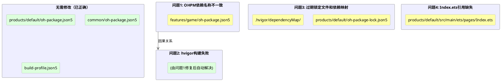
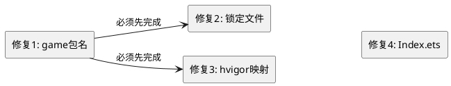

# 技术设计文档：FingerBeat 构建配置修复

## 1. 设计概述

本设计文档描述 FingerBeat 项目构建配置修复的技术方案。修复范围涵盖 4 个问题域：OHPM 依赖名称不一致、过期依赖锁定文件、过期 hvigor 依赖映射、入口页面引用缺失文件。所有修复遵循最小化改动原则。

## 2. 架构设计

### 2.1 修复影响范围



### 2.2 修复依赖关系



修复1（game 包名）是修复2和修复3的前置条件，因为锁定文件和依赖映射中需要使用修复后的包名 `@ohos/game`。修复4与其他修复无依赖关系，可并行执行。

## 3. 技术方案详细设计

### 3.1 修复1：OHPM 依赖名称一致性

#### 3.1.1 修改文件

**文件路径**：`features/game/oh-package.json5`

#### 3.1.2 修改内容

将 `name` 字段从 `"game"` 修改为 `"@ohos/game"`：

```json5
{
  "name": "@ohos/game",  // 修改: "game" → "@ohos/game"
  "version": "1.0.0",
  "description": "FingerBeat game core module",
  "main": "Index.ets",
  "author": "",
  "license": "",
  "dependencies": {
    "@ohos/common": "file:../../common"
  }
}
```

#### 3.1.3 修改理由

- `products/default/oh-package.json5` 中引用名为 `"@ohos/game"`
- `common/oh-package.json5` 中 `name` 为 `"@ohos/common"`，遵循 `@ohos/` 前缀约定
- OHPM 要求引用名与被引用包的 `name` 字段完全一致
- 修改被引用方（game）的 `name` 比修改所有引用方更合理，因为 `@ohos/` 前缀是项目约定

#### 3.1.4 影响分析

- `features/game/Index.ets` 中的 export 语句不受影响（模块内部导出不依赖包名）
- `features/game/hvigorfile.ts` 中的 `export { harTasks } from '@ohos/hvigor-ohos-har'` 不受影响（这是 hvigor 工具依赖，不是项目模块依赖）
- 问题2（hvigor 构建失败）将因此修复而自动解决

### 3.2 修复2：过期依赖锁定文件

#### 3.2.1 修改文件

**文件路径**：`products/default/oh-package-lock.json5`

#### 3.2.2 修改内容

完整替换为以下内容，移除 `@ohos/adaptivelayout` 和 `@ohos/responsivelayout`，新增 `@ohos/game`：

```json5
{
  "meta": {
    "stableOrder": true,
    "enableUnifiedLockfile": false
  },
  "lockfileVersion": 3,
  "ATTENTION": "THIS IS AN AUTOGENERATED FILE. DO NOT EDIT THIS FILE DIRECTLY.",
  "specifiers": {
    "@ohos/game@../../features/game": "@ohos/game@../../features/game",
    "@ohos/common@../../common": "@ohos/common@../../common"
  },
  "packages": {
    "@ohos/game@../../features/game": {
      "name": "@ohos/game",
      "version": "1.0.0",
      "resolved": "../../features/game",
      "registryType": "local",
      "dependencies": {
        "@ohos/common": "file:../../common"
      }
    },
    "@ohos/common@../../common": {
      "name": "@ohos/common",
      "version": "1.0.0",
      "resolved": "../../common",
      "registryType": "local"
    }
  }
}
```

#### 3.2.3 修改理由

- 锁定文件引用了不存在的 `@ohos/adaptivelayout` 和 `@ohos/responsivelayout`（这两个模块已从项目中移除）
- 实际存在的 feature 模块是 `game`，需要在锁定文件中正确注册
- `@ohos/common` 条目保持不变

### 3.3 修复3：过期 hvigor 依赖映射

#### 3.3.1 修改文件清单

| 文件路径 | 操作 |
|---------|------|
| `.hvigor/dependencyMap/default/oh-package.json5` | 修改 |
| `.hvigor/dependencyMap/dependencyMap.json5` | 修改 |
| `.hvigor/dependencyMap/adaptiveLayout/` | 删除目录 |
| `.hvigor/dependencyMap/responsiveLayout/` | 删除目录 |
| `.hvigor/dependencyMap/game/oh-package.json5` | 新建 |

#### 3.3.2 修改内容

**文件1**：`.hvigor/dependencyMap/default/oh-package.json5`

```json5
{
  "name": "default",
  "version": "1.0.0",
  "description": "Please describe the basic information.",
  "main": "",
  "author": "",
  "license": "",
  "dependencies": {
    "@ohos/game": "file:../../features/game",
    "@ohos/common": "file:../../common"
  }
}
```

**文件2**：`.hvigor/dependencyMap/dependencyMap.json5`

```json5
{
  "basePath": "E:\\Dev_HarmonyOS\\FingerBeat\\.hvigor\\dependencyMap\\dependencyMap.json5",
  "rootDependency": "./oh-package.json5",
  "dependencyMap": {
    "default": "./default/oh-package.json5",
    "common": "./common/oh-package.json5",
    "game": "./game/oh-package.json5"
  },
  "modules": [
    {
      "name": "default",
      "srcPath": "..\\..\\..\\products\\default"
    },
    {
      "name": "common",
      "srcPath": "..\\..\\..\\common"
    },
    {
      "name": "game",
      "srcPath": "..\\..\\..\\features\\game"
    }
  ]
}
```

**文件3（新建）**：`.hvigor/dependencyMap/game/oh-package.json5`

```json5
{
  "name": "@ohos/game",
  "version": "1.0.0",
  "description": "FingerBeat game core module",
  "main": "Index.ets",
  "author": "",
  "license": "",
  "dependencies": {
    "@ohos/common": "file:../../common"
  }
}
```

#### 3.3.3 删除操作

- 删除 `.hvigor/dependencyMap/adaptiveLayout/` 目录及其下所有文件
- 删除 `.hvigor/dependencyMap/responsiveLayout/` 目录及其下所有文件

#### 3.3.4 修改理由

- 依赖映射必须与 `build-profile.json5` 中的模块注册保持一致
- `build-profile.json5` 已正确注册 `game` 模块，不包含 `adaptiveLayout` 和 `responsiveLayout`
- 旧模块的映射目录和配置必须移除，否则 hvigor 会尝试解析不存在的模块

### 3.4 修复4：入口页面引用缺失文件

#### 3.4.1 修改文件

**文件路径**：`products/default/src/main/ets/pages/Index.ets`

#### 3.4.2 修改内容

移除对不存在文件的引用，替换为最小可编译的主菜单占位页面：

```typescript
/**
 * Index is the entry of application.
 * Main menu page with app title and start button.
 */
@Entry
@Component
struct Index {
  build() {
    Column() {
      Text('FingerBeat')
        .fontSize(32)
        .fontWeight(FontWeight.Bold)
        .margin({ bottom: 24 })

      Button('开始游戏')
        .fontSize(18)
        .width('60%')
        .height(48)
    }
    .width('100%')
    .height('100%')
    .justifyContent(FlexAlign.Center)
    .backgroundColor($r('sys.color.ohos_id_color_sub_background'))
  }
}
```

#### 3.4.3 修改理由

- `../view/CatalogueListComponent` 和 `../viewmodel/CatalogueViewModel` 是旧模板项目的遗留引用，对应文件和目录均不存在
- 不创建这些缺失文件，因为它们不属于 FingerBeat 的架构设计
- 替换为最小可编译页面，展示应用标题和开始按钮，作为主菜单占位实现
- 不引入对 `@ohos/game` 的依赖，保持入口页面简洁；游戏功能页面将在后续迭代中通过 Navigation 路由实现

#### 3.4.4 设计决策

- **不使用 Navigation/NavPathStack**：当前修复范围仅确保入口页面可编译，完整的页面导航系统属于功能开发范畴
- **不引用 game 模块**：入口页面作为应用壳（shell），不应直接依赖业务模块；后续通过路由懒加载
- **硬编码中文字符串**：最小化改动原则，国际化（`$r('app.string.xxx')`）属于功能完善范畴

## 4. 数据模型

本次修复不涉及数据模型变更。

## 5. API 设计

本次修复不涉及 API 变更。

## 6. 修改文件汇总

| 序号 | 文件路径 | 操作 | 关联问题 |
|------|---------|------|---------|
| 1 | `features/game/oh-package.json5` | 修改 name 字段 | 问题1 |
| 2 | `products/default/oh-package-lock.json5` | 替换全部内容 | 问题3 |
| 3 | `.hvigor/dependencyMap/default/oh-package.json5` | 替换 dependencies | 问题3 |
| 4 | `.hvigor/dependencyMap/dependencyMap.json5` | 替换 dependencyMap 和 modules | 问题3 |
| 5 | `.hvigor/dependencyMap/adaptiveLayout/` | 删除目录 | 问题3 |
| 6 | `.hvigor/dependencyMap/responsiveLayout/` | 删除目录 | 问题3 |
| 7 | `.hvigor/dependencyMap/game/oh-package.json5` | 新建文件 | 问题3 |
| 8 | `products/default/src/main/ets/pages/Index.ets` | 替换全部内容 | 问题4 |

## 7. 验证方案

### 7.1 构建验证

1. 在 DevEco Studio 中执行 `ohpm install`，验证无依赖名称不一致错误
2. 执行 hvigor 构建，验证所有模块编译成功
3. 验证 `products/default` 模块可正常打包为 HAP

### 7.2 配置一致性验证

1. 验证 `features/game/oh-package.json5` 的 `name` 为 `"@ohos/game"`
2. 验证 `products/default/oh-package.json5` 的 dependencies 中 `"@ohos/game"` 引用路径正确
3. 验证 `products/default/oh-package-lock.json5` 不包含 `adaptivelayout` 和 `responsiveLayout`
4. 验证 `.hvigor/dependencyMap/` 目录结构仅包含 `default/`、`common/`、`game/` 三个子目录
5. 验证 `dependencyMap.json5` 的 modules 与 `build-profile.json5` 的 modules 一致

### 7.3 入口页面验证

1. 验证 `Index.ets` 无 import 错误
2. 验证应用启动后显示包含 "FingerBeat" 标题和 "开始游戏" 按钮的页面
