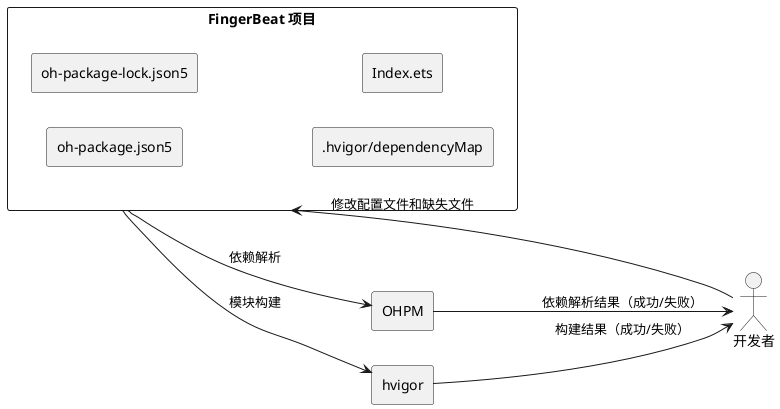

# **1. 组件定位**

## **1.1 核心职责**

本组件负责修复 FingerBeat 项目的构建配置和依赖问题，使项目能够通过 OHPM 依赖解析和 hvigor 构建，并正确启动应用入口页面。

## **1.2 核心输入**

1. 当前项目各模块的 `oh-package.json5` 配置文件
2. 当前项目的 `oh-package-lock.json5` 锁定文件
3. 当前项目的 `.hvigor/dependencyMap/` 构建依赖映射
4. 当前项目的 `build-profile.json5` 模块注册信息
5. 当前项目的入口页面 `Index.ets` 及其引用依赖
6. `game` 模块导出的 API（`features/game/Index.ets`）

## **1.3 核心输出**

1. 修复后可通过 OHPM 依赖解析的项目配置
2. 修复后可通过 hvigor 构建的项目配置
3. 修复后可正确编译和运行的应用入口页面

## **1.4 职责边界**

1. 不负责新增功能开发
2. 不负责 UI 页面完整实现（仅修复入口页面的编译错误）
3. 不负责代码逻辑重构
4. 修复方案遵循最小化改动原则，仅修复必要的配置和缺失文件

# **2. 领域术语**

**OHPM 依赖名称一致性**
: HarmonyOS 包管理器（OHPM）要求 `oh-package.json5` 中引用本地依赖时，引用名称必须与被引用包的 `name` 字段完全一致。例如，若 `features/game/oh-package.json5` 中 `name` 为 `"game"`，则引用方必须使用 `"game"` 而非 `"@ohos/game"`。

**oh-package-lock.json5**
: OHPM 自动生成的依赖锁定文件，记录已解析的依赖版本和路径。当模块结构变更后，此文件可能过期，需要重新生成或手动更新。

**hvigor dependencyMap**
: hvigor 构建工具维护的依赖映射缓存，位于 `.hvigor/dependencyMap/` 目录下。当模块结构变更后，此映射可能过期，需要与实际模块结构保持一致。

**build-profile.json5**
: HarmonyOS 项目顶层构建配置文件，其中 `modules` 数组注册了项目中所有模块的名称和路径。

**CatalogueListComponent / CatalogueViewModel**
: 原模板项目中的曲目列表组件和视图模型，在 FingerBeat 重构后已被移除，但入口页面仍引用这些不存在的文件。

# **3. 角色与边界**

## **3.1 核心角色**

- **开发者**：执行配置修复和缺失文件创建，验证构建通过

## **3.2 外部系统**

- **OHPM**：HarmonyOS 包管理器，负责依赖解析和锁定文件生成
- **hvigor**：HarmonyOS 构建工具，负责模块编译和打包
- **DevEco Studio**：IDE，负责触发构建和显示错误信息

## **3.3 交互上下文**

# **4. DFX约束**

## **4.1 可靠性**

1. 修复后 OHPM 依赖解析必须成功，无名称不一致错误
2. 修复后 hvigor 构建必须成功，无模块加载失败错误
3. 修复后应用入口页面必须可编译，无引用缺失文件错误

## **4.2 可维护性**

1. 修复方案必须最小化改动，不引入不必要的变更
2. 修复后的配置必须与 `build-profile.json5` 中的模块注册保持一致
3. 修复后的依赖命名必须遵循项目既有约定（`@ohos/` 前缀）

## **4.3 兼容性**

1. 修复后项目必须兼容 HarmonyOS SDK 6.0.2(22)
2. 修复不得改变 `build-profile.json5` 中已正确的模块注册

# **5. 核心能力**

## **5.1 OHPM 依赖名称一致性修复**

### **5.1.1 业务规则**

1. **game 模块包名修复**：`features/game/oh-package.json5` 中的 `name` 字段必须从 `"game"` 修改为 `"@ohos/game"`，使其与 `products/default/oh-package.json5` 中的引用名 `"@ohos/game"` 保持一致

   a. 验收条件：[OHPM 执行依赖解析] → [不再报错 `local dependency "@ohos/game" does not match the actual name "game"`]

2. **命名约定一致性**：修复后 `game` 模块的包名必须与 `common` 模块保持相同的 `@ohos/` 前缀命名约定

   a. 验收条件：[检查 `features/game/oh-package.json5` 的 `name` 字段] → [值为 `"@ohos/game"`，与 `@ohos/common` 命名约定一致]

3. **引用方无需修改**：`products/default/oh-package.json5` 中对 `@ohos/game` 的引用保持不变，因为引用名已经是正确的

   a. 验收条件：[检查 `products/default/oh-package.json5` 的 dependencies] → [`@ohos/game` 引用保持 `"file:../../features/game"` 不变]

### **5.1.2 异常场景**

1. **修改后名称仍不匹配**

   a. 触发条件：修改 `name` 字段时拼写错误

   b. 系统行为：OHPM 依赖解析仍然失败

   c. 用户感知：构建报错，错误信息与修复前类似

## **5.2 过期依赖锁定文件修复**

### **5.2.1 业务规则**

1. **products/default/oh-package-lock.json5 更新**：锁定文件中的 `specifiers` 和 `packages` 必须移除不存在的 `@ohos/adaptivelayout` 和 `@ohos/responsivelayout`，替换为实际存在的 `@ohos/game`

   a. 验收条件：[检查 `products/default/oh-package-lock.json5`] → [不包含 `adaptivelayout` 和 `responsiveLayout`，包含 `@ohos/game` 且 resolved 路径为 `"../../features/game"`]

2. **game 模块依赖信息**：锁定文件中 `@ohos/game` 的包信息必须包含正确的 `name`、`version`、`resolved`、`registryType` 和 `dependencies`

   a. 验收条件：[检查锁定文件中 `@ohos/game` 条目] → [`name` 为 `"@ohos/game"`，`version` 为 `"1.0.0"`，`resolved` 为 `"../../features/game"`，`dependencies` 包含 `"@ohos/common": "file:../../common"`]

3. **common 模块信息保持不变**：锁定文件中 `@ohos/common` 的包信息必须保持不变

   a. 验收条件：[检查锁定文件中 `@ohos/common` 条目] → [与修复前一致]

### **5.2.2 异常场景**

1. **锁定文件格式错误**

   a. 触发条件：手动编辑时 JSON5 语法错误

   b. 系统行为：OHPM 解析锁定文件失败

   c. 用户感知：构建报错

## **5.3 过期 hvigor 依赖映射修复**

### **5.3.1 业务规则**

1. **dependencyMap/default/oh-package.json5 更新**：依赖映射中 `default` 模块的 dependencies 必须移除不存在的 `@ohos/adaptivelayout` 和 `@ohos/responsivelayout`，替换为 `@ohos/game`

   a. 验收条件：[检查 `.hvigor/dependencyMap/default/oh-package.json5` 的 dependencies] → [不包含 `adaptivelayout` 和 `responsiveLayout`，包含 `"@ohos/game": "file:../../features/game"`]

2. **dependencyMap.json5 更新**：依赖映射主文件中的 `dependencyMap` 和 `modules` 必须移除 `adaptiveLayout` 和 `responsiveLayout`，替换为 `game`

   a. 验收条件：[检查 `.hvigor/dependencyMap/dependencyMap.json5`] → [`dependencyMap` 包含 `"game"` 键且不包含 `adaptiveLayout`/`responsiveLayout`；`modules` 包含 `name: "game"` 且 srcPath 指向 `features/game`]

3. **移除过期的模块映射目录**：`.hvigor/dependencyMap/adaptiveLayout/` 和 `.hvigor/dependencyMap/responsiveLayout/` 目录必须被移除

   a. 验收条件：[检查 `.hvigor/dependencyMap/` 目录] → [不存在 `adaptiveLayout/` 和 `responsiveLayout/` 子目录]

4. **新增 game 模块映射目录**：必须创建 `.hvigor/dependencyMap/game/oh-package.json5`，内容与 `features/game/oh-package.json5` 一致（使用修复后的 `name` 值）

   a. 验收条件：[检查 `.hvigor/dependencyMap/game/oh-package.json5`] → [`name` 为 `"@ohos/game"`，`dependencies` 包含 `"@ohos/common": "file:../../common"`]

### **5.3.2 异常场景**

1. **映射目录残留**

   a. 触发条件：旧模块映射目录未被完全移除

   b. 系统行为：hvigor 可能尝试解析不存在的模块路径

   c. 用户感知：构建警告或错误

## **5.4 入口页面引用缺失文件修复**

### **5.4.1 业务规则**

1. **移除无效引用**：`products/default/src/main/ets/pages/Index.ets` 中对 `../view/CatalogueListComponent` 和 `../viewmodel/CatalogueViewModel` 的引用必须被移除

   a. 验收条件：[检查 `Index.ets` 的 import 语句] → [不包含对 `CatalogueListComponent` 和 `CatalogueViewModel` 的引用]

2. **创建最小可编译入口页面**：修复后的 `Index.ets` 必须是一个可编译的 `@Entry @Component` 组件，作为应用入口页面

   a. 验收条件：[hvigor 构建 `products/default`] → [Index.ets 编译成功，无引用缺失文件错误]

3. **入口页面内容**：修复后的 `Index.ets` 应展示应用标题"FingerBeat"和"开始游戏"按钮，作为主菜单页面的占位实现

   a. 验收条件：[应用启动后] → [显示包含"FingerBeat"标题和"开始游戏"按钮的页面]

4. **不创建被引用的缺失文件**：不创建 `view/CatalogueListComponent` 和 `viewmodel/CatalogueViewModel`，因为这些是旧模板的遗留引用，不属于 FingerBeat 游戏的架构设计

   a. 验收条件：[检查 `products/default/src/main/ets/` 目录] → [不存在 `view/` 和 `viewmodel/` 目录]

### **5.4.2 异常场景**

1. **入口页面编译失败**

   a. 触发条件：修复后的 `Index.ets` 存在语法错误或引用不存在的模块

   b. 系统行为：hvigor 构建失败

   c. 用户感知：构建报错

# **6. 数据约束**

## **6.1 oh-package.json5 格式约束**

1. **name 字段**：非空字符串，对于项目内模块必须使用 `@ohos/` 前缀（如 `"@ohos/game"`、`"@ohos/common"`）
2. **version 字段**：非空字符串，遵循语义化版本格式（如 `"1.0.0"`）
3. **main 字段**：非空字符串，指定模块入口文件（如 `"Index.ets"`）
4. **dependencies 字段**：对象类型，键为依赖包名（必须与被引用包的 `name` 字段一致），值为本地路径（如 `"file:../../common"`）

## **6.2 oh-package-lock.json5 格式约束**

1. **meta.stableOrder**：布尔值，必须为 `true`
2. **meta.enableUnifiedLockfile**：布尔值，必须为 `false`
3. **lockfileVersion**：整数，必须为 `3`
4. **specifiers**：对象类型，键和值均为依赖标识符字符串
5. **packages**：对象类型，键为依赖标识符，值为包含 `name`、`version`、`resolved`、`registryType` 的对象

## **6.3 dependencyMap.json5 格式约束**

1. **basePath**：字符串，指向自身文件的绝对路径
2. **rootDependency**：字符串，指向根 `oh-package.json5` 的相对路径
3. **dependencyMap**：对象类型，键为模块名，值为对应 `oh-package.json5` 的相对路径
4. **modules**：数组类型，每项包含 `name`（模块名）和 `srcPath`（模块源码相对路径）

## **6.4 Index.ets 格式约束**

1. 必须使用 `@Entry` 和 `@Component` 装饰器
2. 必须包含 `build()` 方法
3. 所有 import 语句引用的模块必须存在
4. 不得引用不存在的文件或目录
