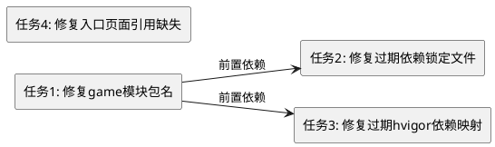

# 编码任务文档：FingerBeat 构建配置修复

## 任务依赖关系



---

## 任务1：修复 game 模块 OHPM 包名

**描述**：将 `features/game/oh-package.json5` 中的 `name` 字段从 `"game"` 修改为 `"@ohos/game"`，使其与引用方 `products/default/oh-package.json5` 中的 `"@ohos/game"` 保持一致，遵循项目 `@ohos/` 前缀命名约定。

**输入**：当前 `features/game/oh-package.json5` 文件（`name` 为 `"game"`）

**输出**：修改后的 `features/game/oh-package.json5` 文件（`name` 为 `"@ohos/game"`）

**验收条件**：
1. `features/game/oh-package.json5` 的 `name` 字段值为 `"@ohos/game"`
2. 文件中其他字段（version、description、main、author、license、dependencies）保持不变
3. OHPM 依赖解析不再报错 `local dependency "@ohos/game" does not match the actual name "game"`

**关联需求**：spec.md 5.1（OHPM 依赖名称一致性修复）

**代码生成提示**：
修改文件 `features/game/oh-package.json5`，将第2行 `"name": "game"` 替换为 `"name": "@ohos/game"`，其余内容保持不变。

---

## 任务2：修复过期依赖锁定文件

**描述**：更新 `products/default/oh-package-lock.json5`，移除不存在的 `@ohos/adaptivelayout` 和 `@ohos/responsivelayout` 条目，新增 `@ohos/game` 条目，使锁定文件与实际项目模块结构一致。

**输入**：当前 `products/default/oh-package-lock.json5` 文件（包含 adaptiveLayout 和 responsiveLayout）

**输出**：更新后的 `products/default/oh-package-lock.json5` 文件（包含 game 和 common）

**验收条件**：
1. 锁定文件的 `specifiers` 中不包含 `adaptivelayout` 和 `responsiveLayout`
2. 锁定文件的 `specifiers` 中包含 `"@ohos/game@../../features/game"`
3. 锁定文件的 `packages` 中包含 `"@ohos/game@../../features/game"` 条目，其 `name` 为 `"@ohos/game"`，`version` 为 `"1.0.0"`，`resolved` 为 `"../../features/game"`，`registryType` 为 `"local"`，`dependencies` 包含 `"@ohos/common": "file:../../common"`
4. 锁定文件中 `@ohos/common` 条目与修复前一致
5. `meta`、`lockfileVersion`、`ATTENTION` 字段保持不变

**前置依赖**：任务1（锁定文件中 game 条目的 name 必须使用修复后的 `"@ohos/game"`）

**关联需求**：spec.md 5.2（过期依赖锁定文件修复）

**代码生成提示**：
替换文件 `products/default/oh-package-lock.json5` 的全部内容为：
```json5
{
  "meta": {
    "stableOrder": true,
    "enableUnifiedLockfile": false
  },
  "lockfileVersion": 3,
  "ATTENTION": "THIS IS AN AUTOGENERATED FILE. DO NOT EDIT THIS FILE DIRECTLY.",
  "specifiers": {
    "@ohos/game@../../features/game": "@ohos/game@../../features/game",
    "@ohos/common@../../common": "@ohos/common@../../common"
  },
  "packages": {
    "@ohos/game@../../features/game": {
      "name": "@ohos/game",
      "version": "1.0.0",
      "resolved": "../../features/game",
      "registryType": "local",
      "dependencies": {
        "@ohos/common": "file:../../common"
      }
    },
    "@ohos/common@../../common": {
      "name": "@ohos/common",
      "version": "1.0.0",
      "resolved": "../../common",
      "registryType": "local"
    }
  }
}
```

---

## 任务3：修复过期 hvigor 依赖映射

**描述**：更新 `.hvigor/dependencyMap/` 目录下的所有相关文件，移除 adaptiveLayout 和 responsiveLayout 的映射，新增 game 模块映射，使依赖映射与 `build-profile.json5` 中的模块注册一致。

### 子任务 3.1：更新 default 模块依赖映射

**描述**：修改 `.hvigor/dependencyMap/default/oh-package.json5`，将 dependencies 中的 `@ohos/adaptivelayout` 和 `@ohos/responsivelayout` 替换为 `@ohos/game`。

**输入**：当前 `.hvigor/dependencyMap/default/oh-package.json5`（包含 adaptiveLayout 和 responsiveLayout）

**输出**：更新后的文件（dependencies 包含 `@ohos/game` 和 `@ohos/common`）

**验收条件**：
1. dependencies 中不包含 `adaptivelayout` 和 `responsiveLayout`
2. dependencies 中包含 `"@ohos/game": "file:../../features/game"`
3. dependencies 中 `"@ohos/common": "file:../../common"` 保持不变
4. name、version、description、main、author、license 字段保持不变

**代码生成提示**：
替换文件 `.hvigor/dependencyMap/default/oh-package.json5` 的全部内容为：
```json5
{
  "name": "default",
  "version": "1.0.0",
  "description": "Please describe the basic information.",
  "main": "",
  "author": "",
  "license": "",
  "dependencies": {
    "@ohos/game": "file:../../features/game",
    "@ohos/common": "file:../../common"
  }
}
```

### 子任务 3.2：更新依赖映射主文件

**描述**：修改 `.hvigor/dependencyMap/dependencyMap.json5`，将 dependencyMap 和 modules 中的 adaptiveLayout 和 responsiveLayout 替换为 game。

**输入**：当前 `.hvigor/dependencyMap/dependencyMap.json5`（包含 adaptiveLayout 和 responsiveLayout 映射）

**输出**：更新后的文件（包含 default、common、game 三个模块映射）

**验收条件**：
1. `dependencyMap` 中不包含 `adaptiveLayout` 和 `responsiveLayout` 键
2. `dependencyMap` 中包含 `"game": "./game/oh-package.json5"`
3. `modules` 数组中不包含 `name` 为 `adaptiveLayout` 和 `responsiveLayout` 的项
4. `modules` 数组中包含 `{ "name": "game", "srcPath": "..\\..\\..\\features\\game" }`
5. `basePath` 和 `rootDependency` 字段保持不变

**代码生成提示**：
替换文件 `.hvigor/dependencyMap/dependencyMap.json5` 的全部内容为：
```json5
{
  "basePath": "E:\\Dev_HarmonyOS\\FingerBeat\\.hvigor\\dependencyMap\\dependencyMap.json5",
  "rootDependency": "./oh-package.json5",
  "dependencyMap": {
    "default": "./default/oh-package.json5",
    "common": "./common/oh-package.json5",
    "game": "./game/oh-package.json5"
  },
  "modules": [
    {
      "name": "default",
      "srcPath": "..\\..\\..\\products\\default"
    },
    {
      "name": "common",
      "srcPath": "..\\..\\..\\common"
    },
    {
      "name": "game",
      "srcPath": "..\\..\\..\\features\\game"
    }
  ]
}
```

### 子任务 3.3：删除旧模块映射目录并新建 game 映射目录

**描述**：删除 `.hvigor/dependencyMap/adaptiveLayout/` 和 `.hvigor/dependencyMap/responsiveLayout/` 目录，新建 `.hvigor/dependencyMap/game/oh-package.json5` 文件。

**输入**：当前 `.hvigor/dependencyMap/` 目录结构（包含 adaptiveLayout/ 和 responsiveLayout/ 子目录）

**输出**：更新后的目录结构（包含 default/、common/、game/ 三个子目录）

**验收条件**：
1. `.hvigor/dependencyMap/adaptiveLayout/` 目录不存在
2. `.hvigor/dependencyMap/responsiveLayout/` 目录不存在
3. `.hvigor/dependencyMap/game/oh-package.json5` 文件存在
4. 该文件 `name` 为 `"@ohos/game"`，`version` 为 `"1.0.0"`，`main` 为 `"Index.ets"`，`dependencies` 包含 `"@ohos/common": "file:../../common"`

**代码生成提示**：
1. 删除目录 `.hvigor/dependencyMap/adaptiveLayout/` 及其下所有文件
2. 删除目录 `.hvigor/dependencyMap/responsiveLayout/` 及其下所有文件
3. 创建目录 `.hvigor/dependencyMap/game/`
4. 在该目录下创建文件 `oh-package.json5`，内容为：
```json5
{
  "name": "@ohos/game",
  "version": "1.0.0",
  "description": "FingerBeat game core module",
  "main": "Index.ets",
  "author": "",
  "license": "",
  "dependencies": {
    "@ohos/common": "file:../../common"
  }
}
```

**前置依赖**：任务1（game 映射文件中的 name 必须使用修复后的 `"@ohos/game"`）

**关联需求**：spec.md 5.3（过期 hvigor 依赖映射修复）

---

## 任务4：修复入口页面引用缺失文件

**描述**：替换 `products/default/src/main/ets/pages/Index.ets` 的全部内容，移除对不存在的 `CatalogueListComponent` 和 `CatalogueViewModel` 的引用，替换为最小可编译的主菜单占位页面。

**输入**：当前 `Index.ets`（引用不存在的 CatalogueListComponent 和 CatalogueViewModel）

**输出**：修复后的 `Index.ets`（可编译的 @Entry @Component 主菜单占位页面）

**验收条件**：
1. 文件中不包含对 `CatalogueListComponent` 和 `CatalogueViewModel` 的 import 语句
2. 文件使用 `@Entry` 和 `@Component` 装饰器
3. 文件包含 `build()` 方法
4. 页面包含 "FingerBeat" 标题（Text 组件）和 "开始游戏" 按钮（Button 组件）
5. 所有 import 语句引用的模块均存在（当前无 import 语句）
6. hvigor 构建 `products/default` 时 Index.ets 编译成功

**关联需求**：spec.md 5.4（入口页面引用缺失文件修复）

**代码生成提示**：
替换文件 `products/default/src/main/ets/pages/Index.ets` 的全部内容为：
```typescript
/**
 * Index is the entry of application.
 * Main menu page with app title and start button.
 */
@Entry
@Component
struct Index {
  build() {
    Column() {
      Text('FingerBeat')
        .fontSize(32)
        .fontWeight(FontWeight.Bold)
        .margin({ bottom: 24 })

      Button('开始游戏')
        .fontSize(18)
        .width('60%')
        .height(48)
    }
    .width('100%')
    .height('100%')
    .justifyContent(FlexAlign.Center)
    .backgroundColor($r('sys.color.ohos_id_color_sub_background'))
  }
}
```
