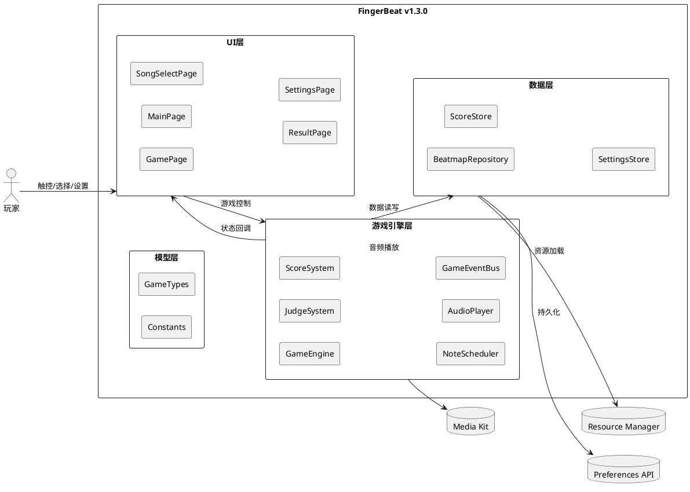

# **1. 实现模型**

## **1.1 上下文视图**



## **1.2 服务/组件总体架构**

### 模块划分

v1.3.0 采用单 HAP 入口 + HAR 公共模块的架构，保持与当前项目结构一致：

```
FingerBeat/
├── AppScope/                          # 应用全局配置
├── common/                            # 公共 HAR 模块 (@ohos/common)
│   └── src/main/ets/
│       ├── constants/                 # 公共常量
│       └── utils/                     # 工具类（Logger, BreakpointSystem）
├── features/                          # 功能 HAR 模块
│   └── game/                          # 游戏核心模块 (@ohos/game)
│       └── src/main/ets/
│           ├── engine/                # 游戏引擎子系统
│           ├── model/                 # 游戏数据模型
│           ├── data/                  # 数据仓库与持久化
│           ├── constants/             # 游戏常量
│           └── pages/                 # 游戏相关页面
├── products/                          # 产品模块
│   └── default/                       # 入口 HAP
│       └── src/main/ets/
│           ├── pages/                 # 入口页面（MainPage）
│           ├── defaultability/        # Ability 入口
│           └── constants/             # 路由常量
└── resources/                         # 全局资源（音频、图片、国际化）
```

### 层级职责

| 层级 | 目录 | 职责 | 依赖方向 |
|------|------|------|---------|
| UI层 | pages/ | 页面组件，处理用户交互和UI渲染 | → 游戏引擎层, 数据层 |
| 游戏引擎层 | engine/ | 游戏核心逻辑（判定、评分、调度、音频） | → 模型层, 数据层 |
| 数据层 | data/ | 数据仓库、持久化存储 | → 模型层 |
| 模型层 | model/ | 类型定义、枚举、接口 | 无外部依赖 |
| 常量层 | constants/ | 游戏常量、配置值 | 无外部依赖 |

### 核心设计原则

1. **单一职责**：每个类/模块只负责一个明确的功能领域
2. **依赖倒置**：UI层通过抽象接口（GameUIUpdater）与引擎层交互，不直接依赖具体实现
3. **事件驱动**：GameEventBus 实现发布-订阅解耦，引擎内部通信不直接调用
4. **预留扩展**：通过接口定义和枚举预留未来功能（HOLD/SLIDE、导入导出、官方更新）
5. **容错降级**：音频初始化失败时降级为系统时间追踪，持久化失败时使用默认值

## **1.3 实现设计文档**

### 1.3.1 GameEngine 游戏引擎

**职责**：协调判定系统、评分系统、音符调度器、音频播放器，驱动游戏主循环

**核心方法**：
- `start(config: GameConfig, context: Context)`：初始化所有子系统，加载谱面，播放BGM，启动游戏循环
- `gameLoop()`：每16ms执行一次，更新音符位置 → 检测MISS → 回调UI更新 → 检查结束
- `onLaneTap(laneIndex: number)`：处理玩家点击，查找最近音符 → 判定 → 评分 → 播放音效
- `pause()` / `resume()`：暂停/恢复游戏循环和BGM
- `endGame()`：结束游戏，生成GameResult，通知UI
- `quit()`：释放所有资源（停止BGM、清除定时器、释放音频）

**游戏循环机制**：使用 `setInterval(callback, 16)` 驱动，约60FPS

**时间源**：优先使用 AudioPlayer 的 currentPosition 作为游戏时间，音频初始化失败时降级为 `Date.now() - startTime`

**UI回调**：通过 `GameUIUpdater` 抽象类桥接引擎到页面状态更新

### 1.3.2 JudgeSystem 判定系统

**职责**：根据时间偏差判定等级，查找最近可判定音符

**核心方法**：
- `judge(timeOffset: number)`：根据偏差绝对值返回 JudgmentGrade
- `findNearestNote(lane, currentTime, notes, goodWindow)`：在指定轨道查找 goodWindow 内最近的未判定 TAP 音符

**判定窗口配置**（按难度）：

| 难度 | Perfect | Great | Good |
|------|---------|-------|------|
| Easy | 50ms | 100ms | 150ms |
| Normal | 40ms | 80ms | 120ms |
| Hard | 30ms | 60ms | 100ms |

### 1.3.3 ScoreSystem 评分系统

**职责**：计算分数、连击、准确率、字母评级

**核心方法**：
- `onJudgment(grade: JudgmentGrade)`：处理判定，计算分数增量（含连击倍率），返回增量分数
- `getAccuracy()`：返回当前准确率（总分/最大可能分数 * 100）
- `getResult()`：返回完整 GameResult

**评分权重**：Perfect=300, Great=200, Good=100, Miss=0

**连击倍率**：4+=1.1x, 8+=1.2x, 16+=1.3x, 32+=1.4x, 64+=1.5x

**字母评级**：S>=95%, A>=85%, B>=70%, C>=50%, D<50%

### 1.3.4 NoteScheduler 音符调度器

**职责**：更新音符运行时位置，检测MISS音符

**核心方法**：
- `update(currentTime, screenHeight)`：更新所有音符的 currentY 和 isVisible
- `checkMissedNotes(currentTime, goodWindow)`：检测超时未操作的 TAP 音符，返回 MISS 音符ID列表
- `markNoteJudged(noteId)`：标记音符已判定

**位置计算**：`currentY = judgmentLineY - (targetTime - currentTime) * scrollSpeed`

**可见性**：音符在 `[targetTime - NOTE_VISIBLE_AHEAD_TIME, targetTime + NOTE_VISIBLE_BEHIND_TIME]` 时间范围内可见

### 1.3.5 AudioPlayer 音频播放器

**职责**：管理BGM和音效的播放

**核心方法**：
- `initBGM(filePath, context)` / `initSFX(name, filePath, context)`：初始化音频播放器
- `playBGM()` / `pauseBGM()` / `resumeBGM()` / `stopBGM()`：BGM 控制
- `playSFX(name)`：播放音效
- `getCurrentTime()`：获取BGM当前播放位置（毫秒）
- `release()`：释放所有音频资源

**实现方式**：使用 `@kit.MediaKit` 的 `media.AVPlayer`，通过 `resourceManager.getRawFdSync()` 加载 rawfile 音频

**SFX池**：预加载 sfx_hit.wav 和 sfx_miss.wav，预留 sfx_perfect/great/good.wav（不存在时静默跳过）

**容错**：所有音频操作 try-catch 包裹，失败时记录日志但不阻塞游戏

### 1.3.6 GameEventBus 事件总线

**职责**：发布-订阅模式解耦引擎内部通信

**核心方法**：
- `on(eventType, callback)` / `off(eventType, callback)`：订阅/取消订阅
- `emit(eventType, data?)`：发布事件
- `clear()`：清除所有订阅

**事件类型**：NOTE_JUDGED, COMBO_CHANGED, SCORE_UPDATED, GAME_STARTED, GAME_PAUSED, GAME_RESUMED, GAME_ENDED, NOTE_MISSED, FULL_COMBO

### 1.3.7 BeatmapRepository 谱面仓库

**职责**：管理曲目和谱面数据，提供查询接口

**核心方法**：
- `getAllSongs(source?)`：获取曲目列表（可按来源过滤）
- `getSongById(songId)`：按ID查找曲目
- `getBeatmap(songId, difficulty)`：获取谱面
- `addSong(song)` / `removeSong(songId)`：预留扩展方法
- `checkOfficialUpdates()`：预留官方更新检查

**实现**：模块级单例，内置3首曲目数据

### 1.3.8 ScoreStore 分数持久化

**职责**：最佳分数的读写持久化

**核心方法**：
- `init(context)`：初始化 Preferences 存储
- `getBestScore(songId, difficulty)`：获取最佳分数
- `updateBestScore(songId, difficulty, result)`：更新最佳分数（仅当新分数更高时）
- `getAllBestScores()`：获取所有最佳分数

**实现**：使用 `@kit.ArkData` 的 `preferences` API，存储名 `fingerbeat_scores`

### 1.3.9 SettingsStore 设置持久化

**职责**：游戏设置的读写持久化

**核心方法**：
- `init(context)`：初始化 Preferences 存储
- `getSettings()`：获取当前设置
- `updateSettings(partial)`：部分更新设置
- `resetToDefault()`：重置为默认值

**实现**：使用 `@kit.ArkData` 的 `preferences` API，存储名 `fingerbeat_settings`

**默认值**：musicVolume=0.8, sfxVolume=0.8, scrollSpeed=1.0

### 1.3.10 页面组件设计

#### MainPage（主菜单）
- `@Entry @ComponentV2` 入口页面
- 使用 `Navigation` + `NavPathStack` 管理页面栈
- UI：应用图标 + 标题 + 副标题 + "开始游戏"按钮 + "设置"按钮
- 渐变背景
- 注册 NavDestination：SongSelectPage, GamePage, ResultPage, SettingsPage

#### SongSelectPage（曲目选择）
- 曲目列表（ForEach），显示标题、艺术家、各难度最佳分数
- 难度选择器：Easy/Normal/Hard 三按钮
- 选中后点击"开始游戏"跳转 GamePage

#### GamePage（游戏进行）
- 顶部信息栏：Score + Combo
- 音符下落区域：4条轨道 + 判定线(85%位置) + 音符渲染 + 判定结果显示
- 底部：进度条 + 暂停按钮
- 暂停菜单弹窗：继续/退出
- `GamePageUIUpdater` 桥接 GameEngine 回调到页面状态
- 轨道高亮效果（100ms）
- 判定视觉特效（PERFECT/GREAT扩散爆炸, GOOD轻微缩放）
- 系统返回键拦截 → 触发暂停

#### ResultPage（结算）
- 字母评级（大号彩色）+ NEW标识（闪烁动画）+ 得分 + 准确率 + 最大连击
- 判定统计表
- "重试" + "返回曲目列表"按钮

#### SettingsPage（设置）
- 三个 Slider：音乐音量、音效音量、下落速度
- "恢复默认设置"按钮
- 实时保存到 SettingsStore

# **2. 接口设计**

## **2.1 总体设计**

接口设计遵循以下原则：
1. **抽象回调**：GameEngine 通过 GameUIUpdater 抽象类与 UI 层交互，UI 层实现具体回调
2. **事件总线**：GameEventBus 提供发布-订阅接口，解耦引擎内部通信
3. **仓库模式**：BeatmapRepository、ScoreStore、SettingsStore 提供数据访问接口
4. **预留扩展**：通过接口定义预留未来功能（导入导出、官方更新）

## **2.2 接口清单**

### GameUIUpdater（抽象类）

| 方法 | 参数 | 返回值 | 说明 |
|------|------|--------|------|
| `onNotesUpdate` | notes: RuntimeNote[] | void | 音符位置更新回调 |
| `onScoreUpdate` | score: number, increment: number | void | 分数更新回调 |
| `onComboUpdate` | combo: number | void | 连击更新回调 |
| `onJudgmentShow` | grade: JudgmentGrade, lane: number | void | 判定结果显示回调 |
| `onGameEnd` | result: GameResult | void | 游戏结束回调 |

### GameEngine

| 方法 | 参数 | 返回值 | 说明 |
|------|------|--------|------|
| `start` | config: GameConfig, context: Context | void | 启动游戏 |
| `onLaneTap` | laneIndex: number | void | 处理轨道点击 |
| `pause` | - | void | 暂停游戏 |
| `resume` | - | void | 恢复游戏 |
| `quit` | - | void | 退出游戏释放资源 |

### JudgeSystem

| 方法 | 参数 | 返回值 | 说明 |
|------|------|--------|------|
| `judge` | timeOffset: number | JudgmentGrade | 判定等级 |
| `findNearestNote` | lane, currentTime, notes, goodWindow | RuntimeNote \| null | 查找最近可判定音符 |

### ScoreSystem

| 方法 | 参数 | 返回值 | 说明 |
|------|------|--------|------|
| `onJudgment` | grade: JudgmentGrade | number | 处理判定，返回分数增量 |
| `getAccuracy` | - | number | 获取准确率 |
| `getResult` | - | GameResult | 获取完整结果 |

### NoteScheduler

| 方法 | 参数 | 返回值 | 说明 |
|------|------|--------|------|
| `update` | currentTime, screenHeight | void | 更新音符位置 |
| `checkMissedNotes` | currentTime, goodWindow | string[] | 检测MISS音符 |
| `markNoteJudged` | noteId | void | 标记音符已判定 |

### AudioPlayer

| 方法 | 参数 | 返回值 | 说明 |
|------|------|--------|------|
| `initBGM` | filePath, context | Promise\<void\> | 初始化BGM |
| `initSFX` | name, filePath, context | Promise\<void\> | 初始化音效 |
| `playBGM` | - | void | 播放BGM |
| `pauseBGM` | - | void | 暂停BGM |
| `resumeBGM` | - | void | 恢复BGM |
| `stopBGM` | - | void | 停止BGM |
| `playSFX` | name | void | 播放音效 |
| `getCurrentTime` | - | number | 获取当前播放位置(ms) |
| `release` | - | void | 释放资源 |

### GameEventBus

| 方法 | 参数 | 返回值 | 说明 |
|------|------|--------|------|
| `on` | eventType, callback | void | 订阅事件 |
| `off` | eventType, callback | void | 取消订阅 |
| `emit` | eventType, data? | void | 发布事件 |
| `clear` | - | void | 清除所有订阅 |

### BeatmapRepository

| 方法 | 参数 | 返回值 | 说明 |
|------|------|--------|------|
| `getAllSongs` | source?: SongSource | SongInfo[] | 获取曲目列表 |
| `getSongById` | songId | SongInfo \| null | 按ID查找曲目 |
| `getBeatmap` | songId, difficulty | Beatmap \| null | 获取谱面 |
| `addSong` | song | void | 预留：添加曲目 |
| `removeSong` | songId | void | 预留：移除曲目 |
| `checkOfficialUpdates` | - | void | 预留：检查官方更新 |

### ScoreStore

| 方法 | 参数 | 返回值 | 说明 |
|------|------|--------|------|
| `init` | context | Promise\<void\> | 初始化存储 |
| `getBestScore` | songId, difficulty | BestScore \| null | 获取最佳分数 |
| `updateBestScore` | songId, difficulty, result | boolean | 更新最佳分数 |
| `getAllBestScores` | - | Map\<string, BestScore\> | 获取所有最佳分数 |

### SettingsStore

| 方法 | 参数 | 返回值 | 说明 |
|------|------|--------|------|
| `init` | context | Promise\<void\> | 初始化存储 |
| `getSettings` | - | GameSettings | 获取当前设置 |
| `updateSettings` | partial: Partial\<GameSettings\> | void | 部分更新设置 |
| `resetToDefault` | - | void | 重置为默认值 |

### BeatmapEditor（预留接口）

| 方法 | 参数 | 返回值 | 说明 |
|------|------|--------|------|
| `createNote` | lane, targetTime, type | NoteData | 放置音符 |
| `deleteNote` | noteId | boolean | 删除音符 |
| `moveNote` | noteId, lane?, targetTime? | NoteData | 移动音符 |
| `undo` | - | boolean | 撤销操作 |
| `redo` | - | boolean | 重做操作 |
| `preview` | - | void | 预览试玩 |
| `save` | - | Beatmap | 保存谱面 |
| `detectBPM` | audioPath | number | BPM检测（预留） |

### MultiplayerService（预留接口）

| 方法 | 参数 | 返回值 | 说明 |
|------|------|--------|------|
| `createRoom` | songId, difficulty, maxPlayers | RoomInfo | 创建房间 |
| `joinRoom` | roomId | RoomInfo | 加入房间 |
| `leaveRoom` | roomId | void | 退出房间 |
| `setReady` | roomId, ready | void | 设置准备状态 |
| `startGame` | roomId | void | 开始游戏（房主） |
| `syncState` | roomId, playerState | void | 同步玩家状态 |
| `getRanking` | roomId | MultiplayerResult | 获取排行 |

# **4. 数据模型**

## **4.1 设计目标**

1. 所有类型定义集中管理在 `model/GameTypes.ets` 中
2. 使用枚举约束状态和分类值，禁止魔法字符串
3. 预留扩展字段（HOLD/SLIDE、SongSource、BeatmapPackage）
4. 运行时音符（RuntimeNote）继承静态音符（NoteData）添加运行时状态

## **4.2 模型实现**

### 枚举类型

```typescript
enum GameState { IDLE, PLAYING, PAUSED, ENDED }
enum JudgmentGrade { PERFECT, GREAT, GOOD, MISS }
enum LetterGrade { S, A, B, C, D }
enum Difficulty { Easy, Normal, Hard }
enum NoteType { TAP, HOLD, SLIDE }
enum SongSource { BUILTIN, OFFICIAL_UPDATE, PLAYER_IMPORT }
enum GameEventType {
  NOTE_JUDGED, COMBO_CHANGED, SCORE_UPDATED,
  GAME_STARTED, GAME_PAUSED, GAME_RESUMED, GAME_ENDED,
  NOTE_MISSED, FULL_COMBO
}
enum GameMode { SINGLE, MULTI_VERSUS, MULTI_COOP }
enum RoomStatus { WAITING, PLAYING, FINISHED }
```

### 核心接口

```typescript
interface NoteData {
  id: string;           // 唯一标识
  lane: number;         // 轨道编号 [0, laneCount-1]
  targetTime: number;   // 目标时间(ms)
  type: NoteType;       // 音符类型
  holdDuration?: number; // HOLD持续时间(ms)
  endLane?: number;     // SLIDE终点轨道
}

interface RuntimeNote extends NoteData {
  currentY: number;     // 当前Y坐标
  isJudged: boolean;    // 是否已判定
  isVisible: boolean;   // 是否可见
  holdProgress?: number; // HOLD进度 [0,1]
}

interface JudgmentWindows {
  perfectWindow: number;  // Perfect窗口(ms)
  greatWindow: number;    // Great窗口(ms)
  goodWindow: number;     // Good窗口(ms)
}

interface JudgmentResult {
  grade: JudgmentGrade;
  timeOffset: number;     // 时间偏差(ms)
  noteId: string;
}

interface GameConfig {
  songId: string;
  difficulty: Difficulty;
  laneCount: number;      // 默认4
  scrollSpeed: number;    // [0.5, 2.0]
  musicVolume: number;    // [0, 1]
  sfxVolume: number;      // [0, 1]
}

interface GameResult {
  score: number;
  accuracy: number;       // [0, 100]
  letterGrade: LetterGrade;
  maxCombo: number;
  judgmentCounts: Map<JudgmentGrade, number>;
}

interface SongInfo {
  id: string;
  title: string;
  artist: string;
  difficulties: Difficulty[];
  audioFilePath: string;
  coverImagePath?: string;
  duration: number;       // 秒
  bpm: number;
  source: SongSource;
  version?: string;
}

interface Beatmap {
  songId: string;
  difficulty: Difficulty;
  notes: NoteData[];
  version?: string;
}

interface GameSettings {
  musicVolume: number;    // [0, 1], 默认0.8
  sfxVolume: number;      // [0, 1], 默认0.8
  scrollSpeed: number;    // [0.5, 2.0], 默认1.0
}

interface BestScore {
  songId: string;
  difficulty: Difficulty;
  score: number;
  accuracy: number;
  letterGrade: LetterGrade;
  maxCombo: number;
}

interface GamePageParams {
  songId: string;
  difficulty: Difficulty;
}

interface ResultPageParams {
  score: number;
  accuracy: number;
  letterGrade: LetterGrade;
  maxCombo: number;
  perfect: number;
  great: number;
  good: number;
  miss: number;
  songId: string;
  difficulty: Difficulty;
}

interface BeatmapPackage {
  version: string;
  song: SongInfo;
  beatmaps: Beatmap[];
  audioFileName: string;
  coverImageFileName?: string;
}

// 编辑器相关（预留）
interface EditorProject {
  song: SongInfo;
  draft: Beatmap;
  history: EditorAction[];
  historyIndex: number;
  selectedNoteId?: string;
  isModified: boolean;
}

interface EditorAction {
  type: 'CREATE' | 'DELETE' | 'MOVE';
  noteId: string;
  before?: NoteData;   // 操作前状态（用于撤销）
  after?: NoteData;    // 操作后状态（用于重做）
}

// 多人游戏相关（预留）
interface RoomInfo {
  roomId: string;
  hostId: string;
  players: PlayerState[];
  songId: string;
  difficulty: Difficulty;
  maxPlayers: number;
  status: RoomStatus;
}

interface PlayerState {
  playerId: string;
  playerName: string;
  score: number;
  combo: number;
  isReady: boolean;
  isPlaying: boolean;
}

interface MultiplayerResult {
  roomId: string;
  songId: string;
  difficulty: Difficulty;
  rankings: PlayerState[];  // 按score降序
}
```

### 常量配置

```typescript
// 游戏循环
GAME_LOOP_INTERVAL = 16          // ms, ~60FPS
DEFAULT_LANE_COUNT = 4
BASE_SCROLL_SPEED = 0.5          // 像素/ms
JUDGMENT_LINE_RATIO = 0.85       // 判定线距底部比例
NOTE_VISIBLE_AHEAD_TIME = 2000   // ms
NOTE_VISIBLE_BEHIND_TIME = 500   // ms

// 判定窗口（按难度）
JUDGMENT_WINDOWS = {
  Easy:    { perfect: 50, great: 100, good: 150 },
  Normal:  { perfect: 40, great: 80,  good: 120 },
  Hard:    { perfect: 30, great: 60,  good: 100 },
}

// 难度速度倍率
DIFFICULTY_SPEED_MULTIPLIER = { Easy: 0.8, Normal: 1.0, Hard: 1.2 }

// 评分权重
SCORE_WEIGHTS = { PERFECT: 300, GREAT: 200, GOOD: 100, MISS: 0 }

// 连击倍率
COMBO_MULTIPLIERS = [
  { threshold: 64, multiplier: 1.5 },
  { threshold: 32, multiplier: 1.4 },
  { threshold: 16, multiplier: 1.3 },
  { threshold: 8, multiplier: 1.2 },
  { threshold: 4, multiplier: 1.1 },
]

// 字母评级阈值
LETTER_GRADE_THRESHOLDS = { S: 95, A: 85, B: 70, C: 50 }

// 判定颜色
JUDGMENT_COLORS = {
  PERFECT: '#FFD700', GREAT: '#00FF00',
  GOOD: '#00BFFF', MISS: '#FF4500',
}

// 字母评级颜色
LETTER_GRADE_COLORS = {
  S: '#FFD700', A: '#00FF00', B: '#00BFFF',
  C: '#FFA500', D: '#FF4500',
}

// 持久化存储名
SETTINGS_STORE_NAME = 'fingerbeat_settings'
SCORE_STORE_NAME = 'fingerbeat_scores'
```
