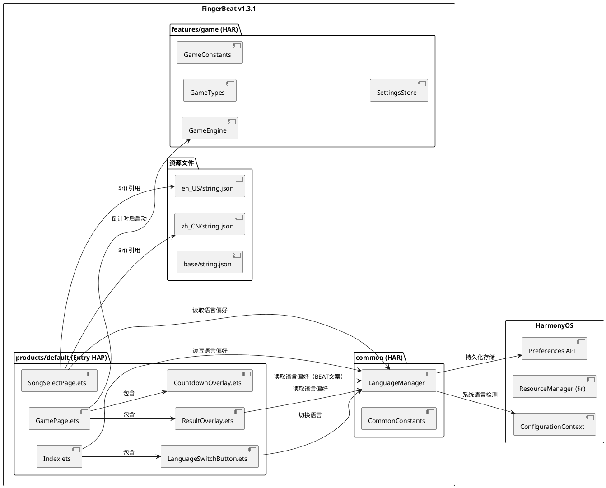
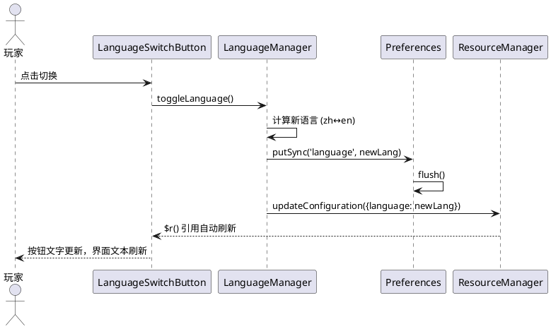
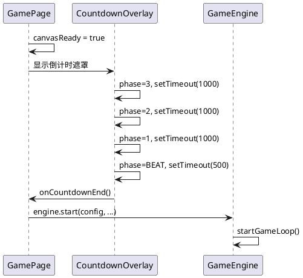
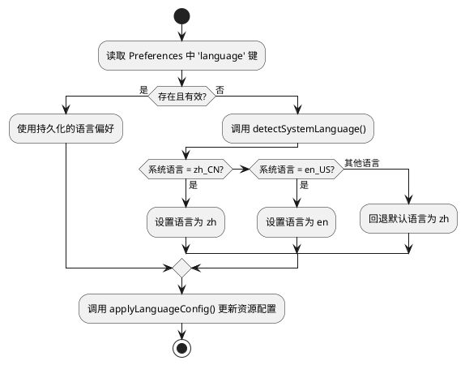
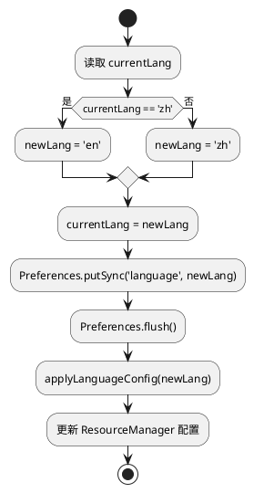

# **1. 实现模型**

## **1.1 上下文视图**

FingerBeat v1.3.1 在 v1.3.0 基础上新增两大能力：**双语界面切换（i18n国际化）** 和 **游戏启动3秒倒计时**。本次改动涉及产品层（products/default）的资源文件、页面组件，以及通用层（common）的语言偏好管理工具，游戏引擎层（features/game）的GameTypes状态扩展。



## **1.2 服务/组件总体架构**

### **1.2.1 分层架构**

```
┌─────────────────────────────────────────────────────────┐
│                    UI 表现层 (Pages)                      │
│  Index.ets │ SongSelectPage.ets │ GamePage.ets           │
│  LanguageSwitchButton.ets │ CountdownOverlay.ets         │
│  ResultOverlay.ets                                       │
├─────────────────────────────────────────────────────────┤
│                   组件/工具层 (common)                     │
│  LanguageManager (语言偏好管理 + 持久化 + 系统语言检测)      │
├─────────────────────────────────────────────────────────┤
│                   游戏引擎层 (features/game)               │
│  GameEngine (新增 COUNTDOWN 状态) │ GameTypes (扩展枚举)   │
│  SettingsStore (复用Preferences)                         │
├─────────────────────────────────────────────────────────┤
│                   资源层 (Resources)                      │
│  zh_CN/string.json │ en_US/string.json │ base/string.json│
└─────────────────────────────────────────────────────────┘
```

### **1.2.2 语言管理架构**

采用 **HarmonyOS 原生资源限定词机制** 实现i18n，核心流程：

1. **LanguageManager**（单例）负责语言偏好的初始化、切换、持久化
2. 通过 `ConfigurationContext` 获取系统语言，判断回退逻辑
3. 语言切换时调用 `context.resourceManager.updateConfiguration()` 更新资源配置，触发所有 `$r()` 引用自动刷新
4. 语言偏好通过 `Preferences API` 持久化到本地



### **1.2.3 倒计时架构**

倒计时作为 GamePage 的子组件（CountdownOverlay），在游戏引擎启动前显示，倒计时结束后通知 GamePage 启动游戏引擎。



## **1.3 实现设计文档**

### **1.3.1 LanguageManager — 语言偏好管理器**

**文件位置**：`common/src/main/ets/utils/LanguageManager.ets`

**职责**：
- 初始化语言偏好（读取持久化 → 系统语言 → 默认中文回退）
- 提供语言切换能力（zh ↔ en 来回切换）
- 持久化语言偏好到 Preferences
- 通知 ResourceManager 更新资源配置，触发全局 `$r()` 刷新

**关键结构**：

```typescript
// 支持的语言编码
type LanguageCode = 'zh' | 'en';

class LanguageManager {
  private preference: preferences.Preferences | null = null;
  private currentLang: LanguageCode = 'zh';
  private context: Context | null = null;
  private static readonly STORE_NAME: string = 'fingerbeat_language';
  private static readonly KEY_LANGUAGE: string = 'language';

  // 初始化：读取持久化 → 系统语言 → 默认中文
  init(context: Context): void;

  // 获取当前语言
  getLanguage(): LanguageCode;

  // 切换语言（zh↔en来回切换）
  toggleLanguage(): void;

  // 设置指定语言
  setLanguage(lang: LanguageCode): void;

  // 获取语言切换按钮显示文本
  getSwitchButtonText(): string; // '中文' | 'EN'

  // 读取系统语言并判定回退
  private detectSystemLanguage(): LanguageCode;

  // 更新资源配置触发$r()刷新
  private applyLanguageConfig(lang: LanguageCode): void;
}

export default new LanguageManager();
```

**初始化逻辑**：



**语言切换流程**：



**applyLanguageConfig 实现**：通过 `context.resourceManager.updateConfiguration()` 设置 `{ language: newLang, region: '' }`，使系统根据新的语言限定词重新加载资源文件，所有 `$r('app.string.xxx')` 引用自动更新。

### **1.3.2 LanguageSwitchButton — 语言切换按钮组件**

**文件位置**：`products/default/src/main/ets/components/LanguageSwitchButton.ets`

**UI样式规格**（来自spec.md 5.1.1规则4-6）：

| 属性 | 值 | 说明 |
|------|-----|------|
| 形状 | 圆角矩形 | borderRadius ≥ 8 |
| 填充色 | 透明 | backgroundColor = Color.Transparent |
| 边框颜色 | 与文字颜色一致 | borderColor = textColor |
| 文字颜色 | 白色系（'#FFFFFF'） | 与深色背景形成对比 |
| 边框宽度 | 1.5px | borderWidth = 1.5 |
| 显示文字 | "中文"(zh模式) / "EN"(en模式) | 与当前界面语言对应 |
| 位置 | 首页左上角 | position({ x: 16, y: 16 }) |
| 尺寸 | 自适应文字+padding | padding: { left: 12, right: 12, top: 6, bottom: 6 } |

**关键结构**：

```typescript
@Component
export struct LanguageSwitchButton {
  @Consume currentLang: string; // 从父组件消费语言状态

  build() {
    Text(this.currentLang === 'zh' ? '中文' : 'EN')
      .fontSize(14)
      .fontColor('#FFFFFF')
      .fontWeight(FontWeight.Bold)
      .padding({ left: 12, right: 12, top: 6, bottom: 6 })
      .borderRadius(8)
      .borderWidth(1.5)
      .borderColor('#FFFFFF')
      .backgroundColor(Color.Transparent)
      .onClick(() => {
        languageManager.toggleLanguage();
      })
  }
}
```

**数据流**：点击 → LanguageManager.toggleLanguage() → Preferences持久化 → ResourceManager更新 → $r()自动刷新 → UI重新渲染。

### **1.3.3 CountdownOverlay — 倒计时遮罩组件**

**文件位置**：`products/default/src/main/ets/components/CountdownOverlay.ets`

**状态机**：

```plantuml
@startuml
[*] --> Three : startCountdown()
Three --> Two : 1000ms后
Two --> One : 1000ms后
One --> Beat : 1000ms后
Beat --> Done : 500ms后
Done --> [*] : onCountdownEnd回调

state Three {
  displayText = "3"
}
state Two {
  displayText = "2"
}
state One {
  displayText = "1"
}
state Beat {
  displayText = "BEAT"
}
@enduml
```

**关键结构**：

```typescript
// 倒计时阶段枚举
enum CountdownPhase {
  THREE,   // 显示"3"
  TWO,     // 显示"2"
  ONE,     // 显示"1"
  BEAT,    // 显示"BEAT"
  DONE     // 倒计时结束
}

@Component
export struct CountdownOverlay {
  @State phase: CountdownPhase = CountdownPhase.THREE;
  @State isActive: boolean = false;
  private timerId: number = -1;
  private onEndCallback: () => void = () => {};

  // 启动倒计时
  start(onEnd: () => void): void;

  // 取消倒计时（返回键场景）
  cancel(): void;

  // 获取当前显示文本
  private getDisplayText(): string; // "3" | "2" | "1" | "BEAT"

  // 推进到下一阶段
  private advance(): void;

  build() {
    if (this.isActive && this.phase !== CountdownPhase.DONE) {
      Stack() {
        // 半透明遮罩
        Column()
          .width('100%')
          .height('100%')
          .backgroundColor('#80000000') // 半透明黑色
          .hitTestBehavior(HitTestMode.Block) // 屏蔽游戏区域触摸

        // 居中大字号倒计时文字
        Text(this.getDisplayText())
          .fontSize(72)
          .fontColor('#FFFFFF')
          .fontWeight(FontWeight.Bold)
          .textAlign(TextAlign.Center)
      }
      .width('100%')
      .height('100%')
    }
  }
}
```

**时序控制**：

| 阶段 | 显示文本 | 持续时间 | 切换方式 |
|------|----------|----------|----------|
| THREE | "3" | 1000ms | setTimeout → advance() |
| TWO | "2" | 1000ms | setTimeout → advance() |
| ONE | "1" | 1000ms | setTimeout → advance() |
| BEAT | "BEAT" | 500ms | setTimeout → onEndCallback() |

**关键设计决策**：
- 使用 `setTimeout` 逐阶段推进，而非 `setInterval`，确保每个阶段独立可控
- 遮罩层 `hitTestBehavior(HitTestMode.Block)` 屏蔽底层触摸事件，满足spec规则5.2.1-4（倒计时期间交互屏蔽）
- `cancel()` 方法清理所有定时器，满足spec规则5.2.3-1（返回键取消倒计时）
- BEAT阶段固定显示"BEAT"，中英文模式下均不翻译，满足spec规则5.2.1-7

### **1.3.4 ResultOverlay — 结算页面组件（提取+国际化）**

**文件位置**：`products/default/src/main/ets/components/ResultOverlay.ets`

**重构说明**：将 GamePage.ets 中现有的结算遮罩逻辑提取为独立组件，所有硬编码文本替换为 `$r()` 资源引用。

**关键结构**：

```typescript
@Component
export struct ResultOverlay {
  @Prop score: number = 0;
  @Prop accuracy: number = 0;
  @Prop maxCombo: number = 0;
  @Prop bestScore: number = 0;
  @Prop isNewRecord: boolean = false;

  build() {
    Column() {
      Text($r('app.string.result_title'))       // "结算" / "Results"
        .fontSize(32).fontColor('#FFFFFF')
      Text(`${$r('app.string.score')}: ${this.score}`)  // "分数: 100" / "Score: 100"
        .fontSize(24).fontColor('#FFD700')
      if (this.isNewRecord) {
        Text($r('app.string.new_record'))       // "新纪录！" / "NEW RECORD!"
          .fontSize(18).fontColor('#FF4500')
      }
      Text(`${$r('app.string.best_score')}: ${this.bestScore}`) // "最佳: 80" / "Best: 80"
        .fontSize(20).fontColor('#AAAAAA')
      Text(`${$r('app.string.accuracy')}: ${(this.accuracy * 100).toFixed(1)}%`)
        .fontSize(20).fontColor('#FFFFFF')
      Text(`${$r('app.string.max_combo')}: ${this.maxCombo}`)
        .fontSize(20).fontColor('#FFFFFF')
      Button($r('app.string.back'))            // "返回" / "Back"
        .onClick(() => { router.back(); })
    }
    .width('100%').height('100%')
    .justifyContent(FlexAlign.Center)
    .backgroundColor('#CC000000')
  }
}
```

### **1.3.5 GamePage 改造 — 集成倒计时**

**改造要点**：

1. **新增 COUNTDOWN 状态**：GamePage 新增 `@State isCountdownActive: boolean = true` 状态变量，初始值为 `true`
2. **改造 tryStartGame()**：不再直接启动游戏引擎，改为启动倒计时组件
3. **新增 onCountdownEnd()**：倒计时结束回调，执行原 `tryStartGame()` 中的引擎启动逻辑
4. **暂停按钮条件**：倒计时期间不显示暂停按钮
5. **aboutToDisappear()**：清理倒计时定时器

```typescript
// GamePage 改造后的关键状态
@State isCountdownActive: boolean = true;
private countdownOverlay: CountdownOverlay | null = null;

// 改造后的 tryStartGame
private tryStartGame(): void {
  if (this.gameStarted || !this.canvasReady || this.h === 0) {
    return;
  }
  this.gameStarted = true;
  // 不再直接启动引擎，启动倒计时
  this.isCountdownActive = true;
}

// 倒计时结束回调
private onCountdownEnd(): void {
  this.isCountdownActive = false;
  // 此时才启动游戏引擎
  const params = router.getParams() as Record<string, Object>;
  // ... 参数解析 ...
  this.engine.start(config, getContext(this), uiUpdater, this.h);
  this.drawTimerId = setInterval(() => { this.draw(); }, DRAW_INTERVAL);
}
```

### **1.3.6 Index 首页改造 — 集成语言切换按钮 + 深色背景一致性**

**改造要点**：

1. **引入 LanguageManager**：在 Index 组件中初始化 LanguageManager
2. **添加 LanguageSwitchButton**：在页面左上角放置语言切换按钮
3. **所有硬编码文本替换为 `$r()` 引用**：
   - `'FingerBeat'` → `$r('app.string.app_name')`
4. **初始化时调用 LanguageManager.init()**
5. **背景色替换**：将系统浅色背景 `$r('sys.color.ohos_id_color_sub_background')` 替换为深色背景 `'#0D0D1A'`，与 SongSelectPage 和 GamePage 保持视觉一致
6. **文字颜色适配深色背景**：首页所有文字颜色改为白色系（`'#FFFFFF'`），确保在深色背景上清晰可读，满足 WCAG 2.1 AA 级对比度标准（`'#FFFFFF'` 与 `'#0D0D1A'` 对比度 ≈ 17.4:1，远超 4.5:1 门槛）
7. **按钮样式适配深色背景**：首页按钮（如"开始击打"按钮）需适配深色背景，按钮文字颜色使用 `'#FFFFFF'`，按钮背景色使用与深色主题协调的样式

**首页深色背景配色规格**：

| 属性 | 原值 | 新值 | 说明 |
|------|------|------|------|
| 页面背景色 | `$r('sys.color.ohos_id_color_sub_background')` | `'#0D0D1A'` | 与 SongSelectPage、GamePage 一致 |
| 标题文字颜色 | 系统默认（深色） | `'#FFFFFF'` | 白色，深色背景上清晰可读 |
| 按钮文字颜色 | 系统默认 | `'#FFFFFF'` | 白色，与深色背景对比度≥4.5:1 |
| 辅助说明文字颜色 | 系统默认 | `'#AAAAAA'` | 浅灰色，辅助文字使用 |

```typescript
@Entry
@Component
struct Index {
  aboutToAppear(): void {
    languageManager.init(getContext(this));
  }

  build() {
    Stack() {
      Column() {
        Text($r('app.string.app_name'))
          .fontSize(32)
          .fontColor('#FFFFFF')
          .fontWeight(FontWeight.Bold)
          .margin({ bottom: 24 })

        Button($r('app.string.start_game'))
          .fontSize(18)
          .fontColor('#FFFFFF')
          .width('60%')
          .height(48)
          .onClick(() => {
            router.pushUrl({ url: 'pages/SongSelectPage' });
          })
      }
      .width('100%')
      .height('100%')
      .justifyContent(FlexAlign.Center)
      .backgroundColor('#0D0D1A')

      // 语言切换按钮 - 固定左上角
      LanguageSwitchButton()
        .position({ x: 16, y: 16 })
    }
    .width('100%')
    .height('100%')
  }
}
```

### **1.3.7 SongSelectPage 改造 — 关卡标题国际化**

**改造要点**：

1. **关卡标题翻译映射**：根据当前语言偏好显示对应关卡标题
2. **难度标签国际化**：替换硬编码的 `'EASY'`/`'NORMAL'`/`'HARD'` 为 `$r()` 引用
3. **描述文本国际化**：关卡描述中的固定文本（如"无BGM"）也需翻译

**关卡标题映射表**：

```typescript
const LEVEL_TITLE_MAP: Map<number, { zh: string; en: string }> = new Map([
  [0, { zh: '牛刀小试', en: 'Warm Up' }],
  [1, { zh: '星空旋律', en: 'Starry Melody' }],
  [2, { zh: '电子脉冲', en: 'Electro Pulse' }],
  [3, { zh: '梦幻节拍', en: 'Dream Beat' }],
]);

// 获取当前语言的关卡标题
function getLevelTitle(levelId: number, lang: string): string {
  const entry = LEVEL_TITLE_MAP.get(levelId);
  if (entry === undefined) {
    return '';
  }
  return lang === 'zh' ? entry.zh : entry.en;
}
```

---

# **2. 接口设计**

## **2.1 总体设计**

### **2.1.1 LanguageManager 公共接口**

| 方法签名 | 功能描述 | 返回值 |
|----------|----------|--------|
| `init(context: Context): void` | 初始化语言管理器，读取持久化偏好或检测系统语言 | 无 |
| `getLanguage(): string` | 获取当前语言编码 | `'zh'` 或 `'en'` |
| `toggleLanguage(): void` | 切换语言（zh↔en来回切换） | 无 |
| `setLanguage(lang: string): void` | 设置指定语言 | 无 |
| `getSwitchButtonText(): string` | 获取语言切换按钮显示文本 | `'中文'` 或 `'EN'` |

### **2.1.2 CountdownOverlay 公共接口**

| 方法签名 | 功能描述 | 返回值 |
|----------|----------|--------|
| `start(onEnd: () => void): void` | 启动倒计时，结束时调用 onEnd 回调 | 无 |
| `cancel(): void` | 取消倒计时，清理定时器和状态 | 无 |

### **2.1.3 ResultOverlay 属性接口**

| 属性名 | 类型 | 说明 |
|--------|------|------|
| `score` | `number` | 结算分数 |
| `accuracy` | `number` | 准确率（0~1） |
| `maxCombo` | `number` | 最大连击数 |
| `bestScore` | `number` | 最佳分数 |
| `isNewRecord` | `boolean` | 是否为新纪录 |

### **2.1.4 LanguageSwitchButton 接口**

该组件为无参组件，通过 `LanguageManager` 单例直接读写语言状态，无需外部传入属性。

## **2.2 接口清单**

### **2.2.1 新增资源词条清单**

以下词条需同时添加到 `zh_CN/string.json`、`en_US/string.json` 和 `base/string.json`，保证三份文件的词条键集合完全一致。

| 词条键 | zh_CN 值 | en_US 值 | base 值 | 使用位置 |
|--------|----------|----------|---------|----------|
| `result_title` | 结算 | Results | Results | ResultOverlay |
| `new_record_full` | 新纪录！ | NEW RECORD! | NEW RECORD! | ResultOverlay |
| `back` | 返回 | Back | Back | ResultOverlay, SongSelectPage |
| `pause_label` | 暂停 | Pause | Pause | GamePage 暂停按钮 |
| `resume_label` | 继续 | Resume | Resume | GamePage 暂停按钮 |
| `score_label` | 分数 | Score | Score | GamePage HUD, ResultOverlay |
| `best_label` | 最佳 | Best | Best | ResultOverlay |
| `accuracy_label` | 准确率 | Accuracy | Accuracy | ResultOverlay |
| `max_combo_label` | 最大连击 | Max Combo | Max Combo | ResultOverlay |
| `countdown_beat` | BEAT | BEAT | BEAT | CountdownOverlay |
| `difficulty_easy` | 简单 | Easy | Easy | SongSelectPage (已有) |
| `difficulty_normal` | 普通 | Normal | Normal | SongSelectPage (已有) |
| `difficulty_hard` | 困难 | Hard | Hard | SongSelectPage (已有) |
| `level_warm_up` | 牛刀小试 | Warm Up | Warm Up | SongSelectPage |
| `level_starry_melody` | 星空旋律 | Starry Melody | Starry Melody | SongSelectPage |
| `level_electro_pulse` | 电子脉冲 | Electro Pulse | Electro Pulse | SongSelectPage |
| `level_dream_beat` | 梦幻节拍 | Dream Beat | Dream Beat | SongSelectPage |
| `no_bgm` | 无BGM | No BGM | No BGM | SongSelectPage |

**注意**：已有的词条（如 `start_game`、`song_select`、`score`、`best_score`、`accuracy`、`max_combo`、`new_record`、`pause`、`resume`）在现有资源文件中已存在，无需重复添加。GamePage 中原有的硬编码文本（`'结算'`、`'Score:'`、`'Best:'`、`'Accuracy:'`、`'Max Combo:'`、`'新纪录！'`、`'返回'`）将替换为对应的 `$r()` 引用。

### **2.2.2 GameTypes 枚举扩展**

在 `GameState` 枚举中新增 `COUNTDOWN` 状态：

```typescript
export enum GameState {
  IDLE,
  COUNTDOWN,  // 新增：倒计时阶段
  PLAYING,
  PAUSED,
  ENDED
}
```

**注意**：此枚举扩展用于GameEngine内部状态标记，GamePage侧通过 `isCountdownActive` 布尔状态控制UI，两者保持同步但不强耦合。

---

# **4. 数据模型**

## **4.1 设计目标**

1. **语言偏好数据**：支持中英文两种语言的偏好存储与切换，满足持久化需求
2. **倒计时状态数据**：支持倒计时各阶段的状态追踪与控制
3. **资源词条完整性**：zh_CN、en_US、base 三份资源文件的词条键集合完全一致
4. **关卡标题映射数据**：提供关卡ID到中英文标题的映射关系

## **4.2 模型实现**

### **4.2.1 LanguagePreference — 语言偏好**

```typescript
interface LanguagePreference {
  languageCode: string;    // 'zh' | 'en'，必填
  lastUpdated: number;     // 毫秒级Unix时间戳，必填
}
```

**持久化键**：`fingerbeat_language` 存储中的 `language` 键。

**初始化判定优先级**：持久化偏好 > 系统语言 > 默认中文

### **4.2.2 CountdownState — 倒计时状态**

```typescript
enum CountdownPhase {
  THREE = 3,   // 显示"3"
  TWO = 2,     // 显示"2"
  ONE = 1,     // 显示"1"
  BEAT,        // 显示"BEAT"
  DONE         // 倒计时结束
}

interface CountdownState {
  phase: CountdownPhase;        // 当前阶段，初始值 THREE
  remainingMs: number;          // 当前阶段剩余毫秒数，[0, 1000]
  isActive: boolean;            // 倒计时是否激活，初始值 false
}
```

### **4.2.3 LevelTitleTranslationMap — 关卡标题翻译映射**

```typescript
interface LevelTitleEntry {
  levelId: number;       // 关卡标识
  titleZh: string;       // 中文标题
  titleEn: string;       // 英文标题
}

const LEVEL_TITLE_MAP: LevelTitleEntry[] = [
  { levelId: 0, titleZh: '牛刀小试', titleEn: 'Warm Up' },
  { levelId: 1, titleZh: '星空旋律', titleEn: 'Starry Melody' },
  { levelId: 2, titleZh: '电子脉冲', titleEn: 'Electro Pulse' },
  { levelId: 3, titleZh: '梦幻节拍', titleEn: 'Dream Beat' },
];
```

### **4.2.4 LanguageSwitchButtonStyle — 语言切换按钮样式**

```typescript
interface LanguageSwitchButtonStyle {
  shape: 'roundedRectangle';          // 圆角矩形
  fillColor: Color;                   // Color.Transparent
  borderColor: string;                // 与 textColor 一致
  textColor: string;                  // '#FFFFFF'
  borderWidth: number;                // 1.5
  borderRadius: number;               // 8
  displayText: '中文' | 'EN';        // 根据 languageCode 决定
}
```

---

# **5. 文件变更清单**

## **5.1 新增文件**

| 文件路径 | 说明 |
|----------|------|
| `common/src/main/ets/utils/LanguageManager.ets` | 语言偏好管理器（单例） |
| `products/default/src/main/ets/components/LanguageSwitchButton.ets` | 语言切换按钮组件 |
| `products/default/src/main/ets/components/CountdownOverlay.ets` | 倒计时遮罩组件 |
| `products/default/src/main/ets/components/ResultOverlay.ets` | 结算页面组件（从GamePage提取） |

## **5.2 修改文件**

| 文件路径 | 变更说明 |
|----------|----------|
| `products/default/src/main/ets/pages/Index.ets` | 添加LanguageSwitchButton、硬编码文本替换为$r()引用、初始化LanguageManager、背景色从系统浅色替换为'#0D0D1A'深色、文字颜色改为'#FFFFFF'适配深色背景 |
| `products/default/src/main/ets/pages/SongSelectPage.ets` | 关卡标题国际化（LEVEL_TITLE_MAP）、难度标签替换为$r()引用、描述文本国际化 |
| `products/default/src/main/ets/pages/GamePage.ets` | 集成CountdownOverlay、提取结算逻辑为ResultOverlay、暂停按钮国际化、倒计时期间屏蔽暂停按钮、硬编码文本替换为$r()引用 |
| `features/game/src/main/ets/model/GameTypes.ets` | GameState枚举新增COUNTDOWN状态 |
| `common/Index.ets` | 导出LanguageManager |
| `common/src/main/resources/base/element/string.json` | 添加新增词条（base版本） |
| `products/default/src/main/resources/zh_CN/element/string.json` | 添加新增词条（中文版本）、修正已有词条值 |
| `products/default/src/main/resources/en_US/element/string.json` | 添加新增词条（英文版本）、修正已有词条值 |
| `products/default/src/main/resources/base/element/string.json` | 添加新增词条（base默认版本） |

## **5.3 不变文件**

| 文件路径 | 说明 |
|----------|------|
| `features/game/src/main/ets/engine/GameEngine.ets` | GameEngine核心逻辑不变，COUNTDOWN状态由GamePage侧管理 |
| `features/game/src/main/ets/data/SettingsStore.ets` | 游戏设置存储不变，语言偏好使用独立的Preferences实例 |
| `features/game/src/main/ets/data/ScoreStore.ets` | 分数存储不变 |
| `features/game/src/main/ets/constants/GameConstants.ets` | 游戏常量不变 |

---

# **6. 关键技术决策**

## **6.1 为何采用 HarmonyOS 原生资源限定词而非第三方 i18n 框架**

1. HarmonyOS 原生机制通过目录命名（zh_CN/en_US）和 `$r()` 引用实现零成本切换，无需引入额外依赖
2. `ResourceManager.updateConfiguration()` 可全局生效，所有 `$r()` 引用自动刷新，无需逐组件手动更新
3. 符合spec.md明确要求"不负责第三方i18n框架的集成，采用HarmonyOS原生资源限定词机制实现"

## **6.2 为何 LanguageManager 独立于 SettingsStore**

1. LanguageManager 属于 UI 表现层的国际化基础设施，SettingsStore 属于游戏引擎层的设置存储
2. 语言偏好需要在应用启动最早阶段（Index页面）初始化，而 SettingsStore 仅在 GamePage 中使用
3. 职责分离：语言偏好是全局级别的UI配置，游戏设置是业务级别的运行参数

## **6.3 为何倒计时组件独立于 GameEngine**

1. 倒计时是纯UI表现逻辑，不涉及游戏核心计算（音符调度、判定、计分）
2. 倒计时结束后才启动 GameEngine，GameEngine 本身无需感知倒计时阶段
3. 组件化有利于复用和测试，倒计时遮罩可独立验证时序和视觉效果
4. GameEngine 的 `GameState.COUNTDOWN` 仅作为扩展标记供外部查询，不改变引擎内部逻辑

## **6.4 为何关卡标题使用静态映射表而非资源文件**

1. 关卡标题与关卡数据强耦合，需要根据 levelId 动态查找
2. HarmonyOS `$r()` 机制不支持动态拼接词条键（如 `$r('app.string.level_' + id)` 在编译期无法解析）
3. 静态映射表 `LEVEL_TITLE_MAP` 在 SongSelectPage 模块内维护，新增关卡时只需添加映射条目

## **6.5 非支持语言默认回退中文的实现**

1. 通过 `ConfigurationContext` 获取系统语言标签
2. 判定逻辑：语言标签以 `'zh'` 开头 → 中文；以 `'en'` 开头 → 英文；其他 → 回退中文
3. 回退中文符合spec.md规则5.1.1-1c 和用户偏好[PREFERENCE_1]（app defaults to Chinese）
