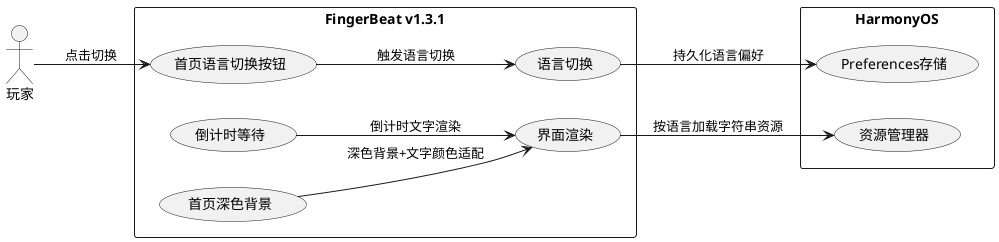
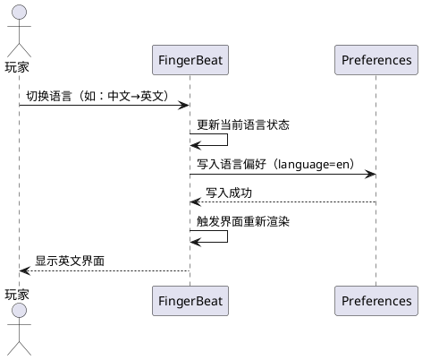
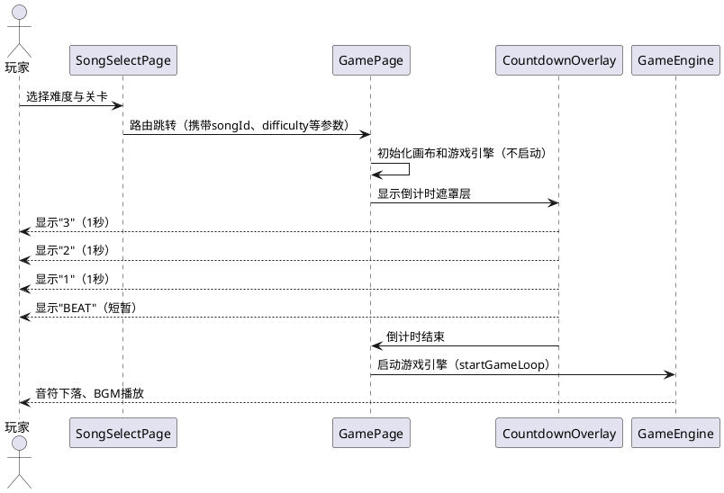
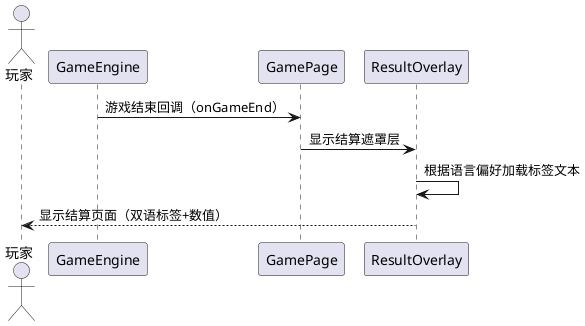
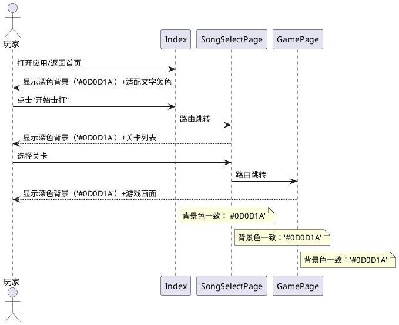

# **1. 组件定位**

## **1.1 核心职责**

本组件负责为FingerBeat应用提供中英文双语界面切换能力（含首页语言切换按钮）、游戏启动前3秒倒计时等待界面、首页深色背景与全局界面视觉一致性，实现国际化支持与游戏准备体验优化及视觉体验统一。

## **1.2 核心输入**

1. 用户语言切换操作指令（中/英文选择，含首页语言切换按钮点击事件）
2. 用户选择难度与关卡后进入游戏的路由跳转事件
3. HarmonyOS系统语言配置（作为默认语言判定依据）
4. 首页背景色配置（需与其他页面深色背景保持一致）

## **1.3 核心输出**

1. 根据当前语言设置渲染对应语言版本的界面文本
2. 首页左上角显示语言切换按钮，点击可在中英文之间切换并实时更新界面
3. 在游戏页面加载后、正式游戏开始前，展示3秒倒计时动画（3→2→1→BEAT）
4. 语言偏好持久化存储，供后续启动时恢复
5. 首页背景色为深色（'#0D0D1A'），与SongSelectPage和GamePage背景一致，文字颜色确保在深色背景上可读

## **1.4 职责边界**

1. 不负责翻译内容的管理与维护（翻译词条为静态配置）
2. 不负责游戏核心逻辑的变更（倒计时仅延迟游戏启动时机，不改变游戏机制）
3. 不负责多语言资源文件以外区域的文本翻译（如BGM文件名、谱面数据等非UI文本）
4. 不负责第三方i18n框架的集成，采用HarmonyOS原生资源限定词机制实现
5. 不负责非首页页面的背景色变更（SongSelectPage和GamePage已使用深色背景，本次仅统一首页）

# **2. 领域术语**

**语言偏好（Language Preference）**
: 用户选择的应用界面显示语言，取值为中文（zh）或英文（en），用于决定界面文本的渲染语言版本。

**倒计时等待界面（Countdown Overlay）**
: 在游戏正式开始前覆盖于游戏画布上方的全屏遮罩层，以动画形式依次显示3、2、1、BEAT四个阶段，持续3秒后自动消失并启动游戏。

**资源限定词（Resource Qualifier）**
: HarmonyOS多语言资源机制，通过目录命名（如zh_CN、en_US）区分不同语言区域的字符串资源，系统根据设备语言自动匹配加载。

**词条键（String Key）**
: 资源文件中用于索引翻译文本的唯一标识符，如`start_game`、`song_select`等，同一词条键在不同语言资源文件中对应不同翻译文本。

**关卡标题翻译映射（Level Title Translation Map）**
: 关卡列表中中文标题与英文标题的固定映射关系，用于将硬编码的关卡标题按语言偏好切换显示。

**语言切换按钮（Language Switch Button）**
: 位于首页左上角的交互控件，采用圆角矩形样式、透明填充、文字颜色与边框颜色一致；框内显示当前界面语言标识（中文模式显示"中文"，英文模式显示"EN"），点击后在中英文之间来回切换并实时刷新界面。

**结算页面（Result Page）**
: 游戏结束后显示的成绩总结界面，包含得分、准确率、最大连击、最佳分数、新纪录标识等信息。

**深色主题背景（Dark Theme Background）**
: 应用全局统一的深色背景色值（'#0D0D1A'），用于首页（Index）、关卡选择页面（SongSelectPage）和游戏页面（GamePage）的页面背景，确保跨页面视觉一致性。

**浅色背景（Light Background）**
: 系统默认浅色背景色值（$r('sys.color.ohos_id_color_sub_background')），为首页旧背景色，需替换为深色主题背景以保持一致性。

**深色背景文字颜色（Dark Background Text Color）**
: 在深色背景（'#0D0D1A'）上使用的文字颜色，需与深色背景形成足够对比度（WCAG 2.1标准对比度≥4.5:1），确保文字清晰可读。

# **3. 角色与边界**

## **3.1 核心角色**

- **玩家**：操作应用的用户，可切换界面语言、选择关卡进入游戏、在倒计时结束后进行游戏操作

## **3.2 外部系统**

- **HarmonyOS资源管理器**：提供基于资源限定词的多语言字符串加载能力（$r('app.string.xxx')机制）
- **HarmonyOS Preferences**：提供轻量级键值对持久化存储，用于保存用户语言偏好设置

## **3.3 交互上下文**

# **4. DFX约束**

## **4.1 性能**

1. 语言切换操作完成后，界面文本刷新延迟不得超过100ms
2. 倒计时动画帧率应保持≥30fps，不得出现卡顿或跳帧
3. 倒计时各阶段（3、2、1、BEAT）的时间间隔误差不得超过±50ms

## **4.2 可靠性**

1. 语言偏好设置在应用异常退出后不得丢失，下次启动应恢复上次选择
2. 倒计时过程中若用户按下返回键，倒计时应立即取消并返回关卡选择页面，不得残留定时器或动画
3. 若设备语言不在支持列表中（非中文/英文），默认使用中文

## **4.3 安全性**

无额外安全要求，语言偏好存储不涉及敏感数据。

## **4.4 可维护性**

1. 新增翻译词条仅需在zh_CN和en_US资源文件中添加对应条目，无需修改业务代码
2. 新增关卡标题翻译仅需在翻译映射表中添加条目

## **4.5 兼容性**

1. 双语切换功能需兼容HarmonyOS API 12及以上版本
2. 倒计时功能需兼容不同屏幕尺寸和分辨率的HarmonyOS设备
3. 已有的资源限定词引用方式（$r('app.string.xxx')）不得被破坏

## **4.6 视觉一致性**

1. 首页背景色必须与SongSelectPage和GamePage保持一致，统一使用深色背景（'#0D0D1A'）
2. 首页所有文字颜色在深色背景上必须满足WCAG 2.1 AA级对比度标准（≥4.5:1），确保可读性
3. 首页深色背景切换不得影响其他页面的现有视觉表现

# **5. 核心能力**

## **5.1 双语界面切换**

### **5.1.1 业务规则**

1. **语言偏好初始化规则**：应用首次启动时，应读取HarmonyOS系统语言设置；若系统语言为中文则默认显示中文界面，若系统语言为英文则默认显示英文界面，若系统语言不在支持列表中（非中文/英文）则默认回退显示中文界面

   a. 验收条件：[系统语言为zh_CN，首次启动应用] → [界面默认显示中文文本]

   b. 验收条件：[系统语言为en_US，首次启动应用] → [界面默认显示英文文本]

   c. 验收条件：[系统语言为其他非支持语言（如ja_JP、ko_KR、fr_FR等），首次启动应用] → [界面默认显示中文文本]

2. **语言切换触发规则**：用户可通过首页语言切换按钮或在应用设置中主动切换语言，切换后所有页面文本应立即更新为对应语言版本

   a. 验收条件：[用户在首页点击语言切换按钮，按钮显示"中文"] → [语言切换为英文，按钮显示更新为"EN"，当前页面及后续所有页面文本均显示英文版本]

   b. 验收条件：[用户在首页点击语言切换按钮，按钮显示"EN"] → [语言切换为中文，按钮显示更新为"中文"，当前页面及后续所有页面文本均显示中文版本]

   c. 验收条件：[用户在设置中从中文切换至英文] → [当前页面及后续所有页面文本均显示英文版本，首页语言切换按钮显示"EN"]

   d. 验收条件：[用户在设置中从英文切换至中文] → [当前页面及后续所有页面文本均显示中文版本，首页语言切换按钮显示"中文"]

3. **语言切换按钮位置规则**：语言切换按钮应固定位于首页左上角区域，始终可见且不受页面滚动影响

   a. 验收条件：[首页加载完成] → [语言切换按钮位于首页左上角区域]

   b. 验收条件：[首页存在滚动内容] → [语言切换按钮位置不随页面滚动而移动，始终固定于左上角]

4. **语言切换按钮UI样式规则**：语言切换按钮应采用圆角矩形样式，填充色为透明，框内文字颜色与边框颜色保持一致

   a. 验收条件：[语言切换按钮渲染显示] → [按钮外观为圆角矩形，填充色为透明（可透视底层背景）]

   b. 验收条件：[语言切换按钮渲染显示] → [按钮框内文字颜色与边框颜色完全一致]

   c. 验收条件：[语言偏好为中文，语言切换按钮显示] → [框内文字显示"中文"，文字颜色与边框颜色一致]

   d. 验收条件：[语言偏好为英文，语言切换按钮显示] → [框内文字显示"EN"，文字颜色与边框颜色一致]

5. **语言切换按钮显示状态与界面语言对应规则**：语言切换按钮框内显示的文字标识应与当前界面语言保持对应关系——框内显示"中文"时界面为中文，框内显示"EN"时界面为英文

   a. 验收条件：[当前界面语言为中文] → [语言切换按钮框内文字显示"中文"]

   b. 验收条件：[当前界面语言为英文] → [语言切换按钮框内文字显示"EN"]

6. **语言切换按钮来回切换规则**：用户通过反复点击首页语言切换按钮，可在中英文之间来回切换；每次点击按钮，按钮文字和界面语言同步切换至另一种语言

   a. 验收条件：[当前按钮显示"中文"，用户点击语言切换按钮] → [按钮文字切换为"EN"，界面语言切换为英文，所有页面文本显示英文版本]

   b. 验收条件：[当前按钮显示"EN"，用户点击语言切换按钮] → [按钮文字切换为"中文"，界面语言切换为中文，所有页面文本显示中文版本]

   c. 验收条件：[用户连续多次点击语言切换按钮] → [每次点击均在中文和英文之间交替切换，不会出现其他状态或卡死]

7. **语言偏好持久化规则**：用户选择的语言偏好应持久化存储，应用重启后自动恢复

   a. 验收条件：[用户切换语言为英文后关闭应用，再次启动] → [界面自动显示英文文本]

8. **关卡标题翻译规则**：关卡选择页面中的关卡标题应按语言偏好显示对应翻译，其中"牛刀小试"译为"Warm Up"，"开始击打"译为"Ready to Beat"

   a. 验收条件：[语言偏好为中文，关卡列表显示] → ["牛刀小试"显示为"牛刀小试"（中文原文）]

   b. 验收条件：[语言偏好为英文，关卡列表显示] → ["牛刀小试"显示为"Warm Up"]

   c. 验收条件：[语言偏好为中文，主页面开始按钮] → [按钮文本显示为"开始击打！"或对应中文词条]

   d. 验收条件：[语言偏好为英文，主页面开始按钮] → [按钮文本显示为"Ready to Beat"]

9. **资源文件词条完整性规则**：zh_CN与en_US资源文件中的词条键集合必须完全一致，不得存在某一语言缺失的词条

   a. 验收条件：[遍历zh_CN资源文件所有词条键] → [en_US资源文件中均存在相同词条键]

   b. 验收条件：[遍历en_US资源文件所有词条键] → [zh_CN资源文件中均存在相同词条键]

10. **禁止项**：禁止在业务逻辑代码中硬编码界面显示文本，所有可显示文本必须通过资源文件词条键引用

   a. 验收条件：[代码审查业务逻辑代码] → [不得出现直接赋值的中英文字符串用于界面显示]

### **5.1.2 交互流程**

### **5.1.3 异常场景**

1. **语言偏好读取失败**

   a. 触发条件：Preferences存储初始化失败或数据损坏

   b. 系统行为：回退使用HarmonyOS系统语言判定逻辑

   c. 用户感知：界面正常显示，语言可能为系统默认而非用户上次选择

2. **资源文件词条缺失**

   a. 触发条件：某语言资源文件中缺少对应词条键

   b. 系统行为：回退使用base资源文件中的默认值

   c. 用户感知：该位置显示base语言文本（通常为英文）

---

## **5.2 游戏启动倒计时**

### **5.2.1 业务规则**

1. **倒计时触发规则**：当玩家在关卡选择页面选择难度和关卡后跳转至游戏页面，游戏页面加载完成后应先显示倒计时等待界面，而非立即开始游戏

   a. 验收条件：[玩家选择关卡并跳转至GamePage] → [游戏页面加载完成后显示倒计时遮罩层，游戏引擎尚未启动]

2. **倒计时阶段规则**：倒计时依次显示四个阶段：数字"3"持续1秒、数字"2"持续1秒、数字"1"持续1秒、"BEAT"短暂显示后消失，总计约3秒

   a. 验收条件：[倒计时开始] → [第0~1秒显示"3"，第1~2秒显示"2"，第2~3秒显示"1"，第3秒起短暂显示"BEAT"后消失]

3. **倒计时结束规则**：倒计时完成后，倒计时遮罩层消失，游戏引擎正式启动，音符开始下落，BGM开始播放

   a. 验收条件：[倒计时"BEAT"阶段结束] → [遮罩层消失，游戏画面可见，音符开始下落，BGM开始播放]

4. **倒计时期间交互屏蔽规则**：倒计时显示期间，游戏区域的点击/触摸事件应被屏蔽，玩家无法进行击打操作

   a. 验收条件：[倒计时进行中，玩家点击游戏区域] → [点击事件不传递至游戏引擎，无击打判定]

5. **倒计时与暂停按钮规则**：倒计时期间暂停按钮应不可见或不可操作，避免倒计时阶段触发暂停逻辑

   a. 验收条件：[倒计时进行中] → [暂停按钮不显示或点击无响应]

6. **倒计时视觉规则**：倒计时数字应以居中、大字号显示于游戏画布上方，背景半透明遮罩覆盖游戏区域，确保数字清晰可辨

   a. 验收条件：[倒计时数字显示] → [数字居中、字号≥48sp、颜色与背景对比度≥4.5:1]

7. **倒计时国际化规则**：倒计时的数字"3"、"2"、"1"为阿拉伯数字，无需翻译；"BEAT"为固定英文标识，在中文和英文模式下均显示为"BEAT"

   a. 验收条件：[语言偏好为中文，倒计时显示] → [依次显示"3"、"2"、"1"、"BEAT"]

   b. 验收条件：[语言偏好为英文，倒计时显示] → [依次显示"3"、"2"、"1"、"BEAT"]

8. **禁止项**：倒计时期间禁止启动游戏引擎的游戏循环和音符调度

   a. 验收条件：[倒计时阶段检查GameEngine状态] → [状态为IDLE或COUNTDOWN，不得为PLAYING]

### **5.2.2 交互流程**

### **5.2.3 异常场景**

1. **倒计时期间用户返回**

   a. 触发条件：倒计时进行中，用户按下系统返回键或点击返回按钮

   b. 系统行为：立即取消倒计时定时器，清理倒计时状态，执行路由返回至关卡选择页面

   c. 用户感知：倒计时消失，返回关卡选择页面，游戏引擎未启动

2. **倒计时期间应用切至后台**

   a. 触发条件：倒计时进行中，用户将应用切至后台（如接听电话）

   b. 系统行为：倒计时暂停，记录剩余时间；应用恢复前台后从暂停位置继续倒计时

   c. 用户感知：回到应用后倒计时从离开时的数字继续，不会跳过或重新开始

3. **画布初始化延迟**

   a. 触发条件：GamePage画布初始化（onReady/onAreaChange）在倒计时逻辑启动前尚未完成

   b. 系统行为：等待画布初始化完成后才开始倒计时

   c. 用户感知：页面加载后短暂等待，然后倒计时开始，无空白闪烁

---

## **5.3 结算页面双语显示**

### **5.3.1 业务规则**

1. **结算页面文本国际化规则**：结算页面中的所有固定文本标签（"结算"、"分数"、"最佳"、"准确率"、"最大连击"、"新纪录！"、"返回"等）应通过资源文件词条键引用，按当前语言偏好显示

   a. 验收条件：[语言偏好为中文，游戏结束进入结算页面] → [显示"结算"、"分数"、"最佳"、"准确率"、"最大连击"等中文标签]

   b. 验收条件：[语言偏好为英文，游戏结束进入结算页面] → [显示"Results"、"Score"、"Best"、"Accuracy"、"Max Combo"等英文标签]

2. **结算页面数值显示规则**：得分、准确率、最大连击等数值数据不随语言切换改变，仅标签文本进行切换

   a. 验收条件：[语言偏好从中文切换至英文，结算页面] → [数值不变，标签文本从中文切换至英文]

3. **新纪录标识国际化规则**：新纪录标识文本应按语言偏好显示

   a. 验收条件：[语言偏好为中文，刷新最佳分数] → [显示"新纪录！"]

   b. 验收条件：[语言偏好为英文，刷新最佳分数] → [显示"NEW RECORD!"]

4. **返回按钮国际化规则**：结算页面返回按钮文本应按语言偏好显示

   a. 验收条件：[语言偏好为中文] → [返回按钮显示"返回"]

   b. 验收条件：[语言偏好为英文] → [返回按钮显示"Back"]

### **5.3.2 交互流程**

### **5.3.3 异常场景**

1. **结算页面词条缺失**

   a. 触发条件：结算页面某标签的当前语言词条缺失

   b. 系统行为：回退显示base资源文件中的默认文本

   c. 用户感知：该标签显示默认语言文本，其余内容正常

---

## **5.4 首页深色背景一致性**

### **5.4.1 业务规则**

1. **首页背景色统一规则**：首页（Index）的背景色应使用深色（'#0D0D1A'），与SongSelectPage和GamePage的背景色保持一致，不得使用系统浅色背景（$r('sys.color.ohos_id_color_sub_background')）

   a. 验收条件：[首页加载完成] → [首页背景色为'#0D0D1A'，非系统浅色背景]

   b. 验收条件：[首页与SongSelectPage对比] → [两者背景色均为'#0D0D1A'，视觉上无差异]

   c. 验收条件：[首页与GamePage对比] → [两者背景色均为'#0D0D1A'，视觉上无差异]

2. **首页文字颜色适配规则**：首页背景由浅色改为深色后，所有首页文字颜色必须适配深色背景，确保文字与背景的对比度满足WCAG 2.1 AA级标准（对比度≥4.5:1），保证文字清晰可读

   a. 验收条件：[首页标题文字在深色背景上显示] → [文字颜色与'#0D0D1A'背景的对比度≥4.5:1]

   b. 验收条件：[首页按钮文字在深色背景上显示] → [文字颜色与'#0D0D1A'背景的对比度≥4.5:1]

   c. 验收条件：[首页辅助说明文字在深色背景上显示] → [文字颜色与'#0D0D1A'背景的对比度≥4.5:1]

3. **语言切换按钮深色背景适配规则**：语言切换按钮在首页深色背景上应保持圆角矩形、透明填充、文字颜色与边框颜色一致的样式，且文字和边框颜色需在深色背景上清晰可辨

   a. 验收条件：[首页背景为'#0D0D1A'，语言切换按钮显示] → [按钮为圆角矩形、透明填充、文字颜色与边框颜色一致，且与深色背景对比度≥4.5:1]

   b. 验收条件：[首页背景为'#0D0D1A'，当前按钮显示"中文"] → [文字和边框颜色在深色背景上清晰可辨，无视觉模糊或看不清的问题]

   c. 验收条件：[首页背景为'#0D0D1A'，当前按钮显示"EN"] → [文字和边框颜色在深色背景上清晰可辨，无视觉模糊或看不清的问题]

4. **首页其他元素深色背景适配规则**：首页上除文字和语言切换按钮外的其他UI元素（如图标、分隔线、装饰元素等）在深色背景上也应保持视觉可辨性和一致性

   a. 验收条件：[首页背景为'#0D0D1A'，首页图标显示] → [图标颜色在深色背景上清晰可辨]

   b. 验收条件：[首页背景为'#0D0D1A'，首页分隔线或装饰元素显示] → [元素在深色背景上视觉表现与SongSelectPage中同类元素风格一致]

5. **跨页面过渡视觉一致性规则**：用户从首页跳转至关卡选择页面或游戏页面时，背景色应无跳变或不一致感，实现视觉上的平滑过渡

   a. 验收条件：[用户从首页跳转至SongSelectPage] → [页面背景色一致（均为'#0D0D1A'），无背景色跳变]

   b. 验收条件：[用户从SongSelectPage返回首页] → [页面背景色一致（均为'#0D0D1A'），无背景色跳变]

6. **禁止项**：禁止在首页保留系统浅色背景（$r('sys.color.ohos_id_color_sub_background')），禁止深色背景上使用与背景对比度不足的文字颜色

   a. 验收条件：[代码审查首页背景色引用] → [不得出现$r('sys.color.ohos_id_color_sub_background')或等效系统浅色背景引用]

   b. 验收条件：[代码审查首页文字颜色] → [所有文字颜色与'#0D0D1A'背景的对比度均≥4.5:1，不得使用深色文字（如黑色、深灰色）]

### **5.4.2 交互流程**

### **5.4.3 异常场景**

1. **首页文字对比度不足**

   a. 触发条件：首页背景改为深色后，某些文字颜色未适配，导致在深色背景上对比度不足

   b. 系统行为：文字仍正常渲染显示，但可读性差

   c. 用户感知：部分文字在深色背景上难以辨认或看不清，需修复文字颜色

2. **系统深色/浅色模式切换冲突**

   a. 触发条件：HarmonyOS系统切换深色/浅色模式，系统自动调整部分UI颜色

   b. 系统行为：首页背景色固定为'#0D0D1A'，不受系统深浅色模式影响；文字颜色同样固定适配深色背景的色值，不随系统模式变化

   c. 用户感知：首页始终显示深色背景和适配的文字颜色，不受系统深浅色模式切换影响

# **6. 数据约束**

## **6.1 语言偏好（LanguagePreference）**

1. **languageCode**：语言编码，取值范围为{"zh", "en"}，默认值根据HarmonyOS系统语言判定（zh_CN→"zh"，en_US→"en"，其他非支持语言→"zh"），必填

2. **lastUpdated**：最近更新时间戳，类型为long（毫秒级Unix时间戳），用于审计，必填

## **6.2 倒计时状态（CountdownState）**

1. **phase**：当前阶段，取值范围为{3, 2, 1, BEAT, DONE}，初始值为3，必填

2. **remainingMs**：当前阶段剩余毫秒数，取值范围为[0, 1000]，初始值为1000，必填

3. **isActive**：倒计时是否激活，取值范围为{true, false}，初始值为false，必填

## **6.3 翻译词条（StringResource）**

1. **key**：词条键名，格式为小写字母+下划线组合（如start_game、song_select），同一资源文件内唯一，必填

2. **zhValue**：中文翻译值，非空字符串，必填

3. **enValue**：英文翻译值，非空字符串，必填

## **6.4 关卡标题翻译映射（LevelTitleMap）**

| 关卡ID | 中文标题 | 英文标题 |
|--------|----------|----------|
| 0      | 牛刀小试 | Warm Up  |
| 1      | 星空旋律 | Starry Melody |
| 2      | 电子脉冲 | Electro Pulse |
| 3      | 梦幻节拍 | Dream Beat   |

1. **levelId**：关卡标识，类型为非负整数，与现有关卡列表一致，必填

2. **titleZh**：中文标题，非空字符串，必填

3. **titleEn**：英文标题，非空字符串，必填

## **6.5 语言切换按钮样式（LanguageSwitchButtonStyle）**

1. **shape**：按钮形状，固定为圆角矩形（roundedRectangle），必填

2. **fillColor**：按钮填充色，固定为透明（transparent），即不填充任何颜色，底层背景可透视，必填

3. **borderColor**：按钮边框颜色，与textColor保持一致，必填

4. **textColor**：框内文字颜色，与borderColor保持一致，取值应为视觉上清晰可辨的颜色值，且与深色主题背景（'#0D0D1A'）的对比度≥4.5:1，必填

5. **displayText**：框内显示文字，取值范围为{"中文", "EN"}，当languageCode为"zh"时显示"中文"，当languageCode为"en"时显示"EN"，必填

## **6.6 首页深色背景配置（IndexDarkBackground）**

1. **backgroundColor**：首页背景色，固定为'#0D0D1A'，与SongSelectPage和GamePage背景色一致，不得使用系统浅色背景（$r('sys.color.ohos_id_color_sub_background')），必填

2. **textColor**：首页文字颜色，取值应为与深色背景（'#0D0D1A'）对比度≥4.5:1（WCAG 2.1 AA级标准）的颜色值，如白色（'#FFFFFF'）或浅色系（如'#E0E0E0'），必填

3. **iconColor**：首页图标颜色，取值应为与深色背景（'#0D0D1A'）对比度≥3:1（WCAG 2.1 AA级非文本标准）的颜色值，必填

4. **dividerColor**：首页分隔线/装饰元素颜色，取值应与深色背景协调且视觉可辨，如半透明白色（'rgba(255,255,255,0.2)'）等，选填
