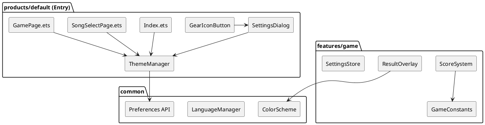
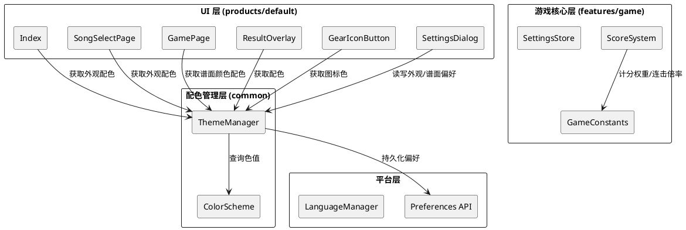
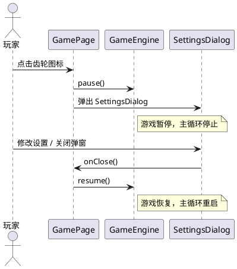
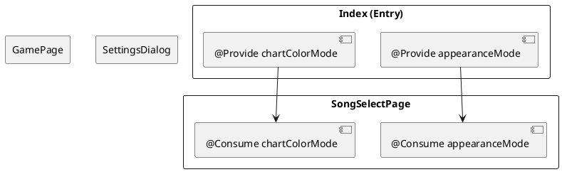

# **1. 实现模型**

## **1.1 上下文视图**



### 上下文说明

本版本 v1.3.2 的修改范围涵盖以下层面：

| 层面 | 修改范围 | 影响模块 |
|------|---------|---------|
| 计分逻辑修正 | 经代码审阅确认，当前 ScoreSystem 实现已与 README 定义完全一致，无需任何代码变更 | 无 |
| 准确率显示修正 | ResultOverlay 中 accuracy 显示公式 | products/default/components |
| 暂停/继续翻译修正 | LanguageManager 翻译词条 + 按钮宽度 | common/utils, products/default/pages |
| 倒计时遮罩修正 | GamePage 倒计时遮罩色值 | products/default/pages |
| 外观模式 + 谱面颜色 | 新增 ThemeManager + ColorScheme + GearIconButton + SettingsDialog | common, products/default |

## **1.2 服务/组件总体架构**

### 架构分层



### 新增组件一览

| 组件 | 位置 | 职责 |
|------|------|------|
| ThemeManager | `common/src/main/ets/utils/ThemeManager.ets` | 外观模式与谱面颜色偏好的读写、切换、持久化，配色方案分发 |
| ColorScheme | `common/src/main/ets/constants/ColorScheme.ets` | 所有配色方案的色值定义（深色/浅色外观 + 深色/浅色谱面） |
| GearIconButton | `products/default/src/main/ets/components/GearIconButton.ets` | 极简描边轮廓齿轮图标，可点击触发回调 |
| SettingsDialog | `products/default/src/main/ets/components/SettingsDialog.ets` | 设置弹窗：外观模式深色/浅色切换 + 谱面颜色深色/浅色切换 |

### 修改现有组件一览

| 组件 | 修改内容 |
|------|---------|
| ResultOverlay.ets | 修正准确率显示公式为 `${accuracy.toFixed(1)}%` |
| GamePage.ets | 倒计时遮罩色值修正为 `#80808080`；新增齿轮图标 + 设置弹窗集成；暂停按钮宽度加宽；绘制方法适配谱面颜色 |
| Index.ets | 背景色/文字色改为从 ThemeManager 获取；新增齿轮图标 |
| SongSelectPage.ets | 背景色/文字色改为从 ThemeManager 获取；新增齿轮图标 |
| LanguageManager.ets | 新增翻译词条：appearance_label / chart_color_label / dark_label / light_label / settings_title |
| common/Index.ets | 导出 ThemeManager |
| features/game/Index.ets | 导出 ColorScheme 类型（如需跨模块使用） |

## **1.3 实现设计文档**

### 1.3.1 计分逻辑修正

**现状分析**：经代码审阅，`ScoreSystem.ets` 与 `GameConstants.ets` 中的计分逻辑已与 README 定义完全一致：

- `SCORE_WEIGHT_PERFECT = 300`, `SCORE_WEIGHT_GREAT = 200`, `SCORE_WEIGHT_GOOD = 100`, `SCORE_WEIGHT_MISS = 0` ✅
- `COMBO_MULTIPLIERS` 阈值序列：`[{64,1.5}, {32,1.4}, {16,1.3}, {8,1.2}, {4,1.1}]` ✅
- `onJudgment()` 计算公式 `Math.floor(baseWeight * comboMultiplier)` ✅

**结论**：经代码审阅确认，当前 ScoreSystem 实现已与 README 定义完全一致，无需任何代码变更。

### 1.3.2 结算界面准确率计算修正

**问题**：`ResultOverlay.ets` 第 40 行：
```typescript
Text(`${this.t('accuracy_label')}: ${(this.accuracy * 100).toFixed(1)}%`)
```
`accuracy` 值由 `ScoreSystem.getAccuracy()` 返回，范围已是 [0, 100]，此处再乘以 100 导致双重百分比转换（如 85.5 → 8550.0%）。

**修正方案**：
```typescript
Text(`${this.t('accuracy_label')}: ${this.accuracy.toFixed(1)}%`)
```

**变更范围**：仅 `ResultOverlay.ets` 第 40 行。

### 1.3.3 暂停/继续按钮英文翻译修正

**现状分析**：

1. `LanguageManager.ets` 翻译词条已正确：
   - `'pause_label': 'Pause'`（英文）/ `'暂停'`（中文） ✅
   - `'resume_label': 'Resume'`（英文）/ `'继续'`（中文） ✅

2. **按钮宽度问题**：`GamePage.ets` 第 277 行暂停按钮宽度为固定 60px，英文 "Resume"（6 字符）在小字号下可能截断。

**修正方案**：

将暂停/继续按钮宽度从固定 60 调整为 72，确保英文 "Resume" 完整显示：
```typescript
Button(this.isPaused ? this.t('resume_label') : this.t('pause_label'))
  .fontSize(14)
  .width(72)    // 原 60，加宽以适配英文 Resume
  .height(32)
```

### 1.3.4 倒计时页面遮罩修正

**问题**：`GamePage.ets` 第 296 行：
```typescript
.backgroundColor('#80000000')
```
当前使用纯黑 50% 透明遮罩（`#80` = 128/255 ≈ 50% alpha，`000000` = 黑色），不符合 spec 要求的 `rgb(128,128,128)` 50% 不透明度。

**修正方案**：

遮罩色值改为 `#80808080`（ARGB 格式：alpha=0x80≈50%, RGB=0x808080=中灰色 128,128,128）：
```typescript
.backgroundColor('#80808080')
```

同时，倒计时文字色需适配当前谱面颜色（深色谱面用白色文字，浅色谱面用深色文字），从 ThemeManager 获取。

### 1.3.5 外观模式与谱面颜色双独立配色方案

#### ThemeManager 设计

```typescript
// common/src/main/ets/utils/ThemeManager.ets

export type AppearanceMode = 'dark' | 'light';
export type ChartColorMode = 'dark' | 'light';

class ThemeManager {
  private preference: preferences.Preferences | null = null;
  private appearanceMode: AppearanceMode = 'dark';
  private chartColorMode: ChartColorMode = 'dark';

  // 持久化键
  private static readonly STORE_NAME: string = 'fingerbeat_settings';
  private static readonly KEY_APPEARANCE: string = 'appearance_mode';
  private static readonly KEY_CHART_COLOR: string = 'chart_color';

  init(context: Context): void;
  getAppearanceMode(): AppearanceMode;
  getChartColorMode(): ChartColorMode;
  setAppearanceMode(mode: AppearanceMode): void;
  setChartColorMode(mode: ChartColorMode): void;

  // 获取配色方案
  getAppearanceColors(): AppearanceColors;
  getChartColors(): ChartColors;
}
```

#### ColorScheme 设计

```typescript
// common/src/main/ets/constants/ColorScheme.ets

// ========== 外观模式配色接口 ==========
export interface AppearanceColors {
  background: string;       // 页面背景色
  primaryText: string;      // 主文字色
  secondaryText: string;    // 次文字色
  divider: string;          // 分割线/装饰元素色
  accent: string;           // 强调色（如金色 #FFD700）
  accentDim: string;        // 次强调色（如 #AAAAAA）
  levelBadgeBg: string;     // 关卡编号背景色
  arrowColor: string;       // 列表箭头色
}

// ========== 谱面颜色配色接口 ==========
export interface ChartColors {
  background: string;       // 游戏画布背景色
  laneLine: string;         // 轨道分隔线色
  judgmentLine: string;     // 判定线色
  tapNote: string;          // TAP 音符色
  holdNote: string;         // HOLD 音符色
  slideNote: string;        // SLIDE 音符色
  scoreText: string;        // 分数文字色
  comboText: string;        // 连击文字色
  judgmentText: string;     // 判定文字色
  missText: string;         // MISS 文字色
  pauseBtnBg: string;       // 暂停按钮背景色
  pauseBtnText: string;     // 暂停按钮文字色
}
```

#### 配色方案色值定义

**深色外观模式（DarkAppearanceColors）**：

| 属性 | 色值 | 说明 |
|------|------|------|
| background | `#0D0D1A` | 深色背景（与现有一致） |
| primaryText | `#FFFFFF` | 白色主文字 |
| secondaryText | `#AAAAAA` | 灰色次文字 |
| divider | `#333366` | 深紫分割线 |
| accent | `#FFD700` | 金色强调 |
| accentDim | `#AAAAAA` | 灰色次强调 |
| levelBadgeBg | `#333366` | 关卡编号背景 |
| arrowColor | `#666699` | 箭头色 |

**浅色外观模式（LightAppearanceColors）**：

| 属性 | 色值 | 说明 |
|------|------|------|
| background | `#F5F5F5` | 浅灰背景（护眼） |
| primaryText | `#1A1A2E` | 深色主文字（对比度 14.7:1） |
| secondaryText | `#666666` | 中灰次文字（对比度 5.7:1） |
| divider | `#CCCCCC` | 浅灰分割线 |
| accent | `#D4A800` | 深金色强调（对比度 ≥ 4.5:1 on #F5F5F5） |
| accentDim | `#666666` | 中灰色次强调 |
| levelBadgeBg | `#DDDDDD` | 浅灰关卡编号背景 |
| arrowColor | `#999999` | 浅灰箭头 |

**深色谱面颜色（DarkChartColors）**：

| 属性 | 色值 | 说明 |
|------|------|------|
| background | `#0D0D1A` | 深色背景（与现有一致） |
| laneLine | `#333366` | 深紫轨道线 |
| judgmentLine | `#FFFFFF` | 白色判定线 |
| tapNote | `#00BFFF` | 天蓝色 TAP |
| holdNote | `#FF6B6B` | 珊瑚色 HOLD |
| slideNote | `#FFD700` | 金色 SLIDE |
| scoreText | `#FFFFFF` | 白色分数 |
| comboText | `#FFD700` | 金色连击 |
| judgmentText | `#FFFFFF` | 白色判定 |
| missText | `#FF4500` | 橙红 MISS |
| pauseBtnBg | `#333366` | 深色按钮背景 |
| pauseBtnText | `#FFFFFF` | 白色按钮文字 |

**浅色谱面颜色（LightChartColors）**：

| 属性 | 色值 | 说明 |
|------|------|------|
| background | `#F0F0F0` | 浅灰背景（护眼） |
| laneLine | `#BBBBBB` | 中灰轨道线 |
| judgmentLine | `#333333` | 深灰判定线 |
| tapNote | `#006699` | 深天蓝 TAP（对比度 5.8:1） |
| holdNote | `#CC3333` | 深珊瑚 HOLD（对比度 4.6:1） |
| slideNote | `#B8860B` | 深金色 SLIDE（对比度 ≥ 4.5:1） |
| scoreText | `#1A1A2E` | 深色分数文字 |
| comboText | `#B8860B` | 深金色连击 |
| judgmentText | `#333333` | 深灰判定 |
| missText | `#CC3300` | 深橙红 MISS |
| pauseBtnBg | `#DDDDDD` | 浅色按钮背景 |
| pauseBtnText | `#1A1A2E` | 深色按钮文字 |

#### GearIconButton 设计

```typescript
// products/default/src/main/ets/components/GearIconButton.ets

@Component
export struct GearIconButton {
  @Prop iconColor: string = '#FFFFFF';  // 由父组件传入当前文字色
  onGearClick: () => void = () => {};

  build() {
    // 使用 Path 绘制极简描边轮廓齿轮图标
    // 6 齿简笔齿轮，仅描边无填充
    // 尺寸 24x24，描边宽度 1.5
    Stack() {
      Shape() {
        // 齿轮外轮廓 Path
        Path()
          .commands('M12,2 L14,5 L17,4 L17,7 L20,8 L18,11 L21,12 ...')
          .stroke(this.iconColor)
          .strokeWidth(1.5)
          .fill(Color.Transparent)
      }
      .width(24)
      .height(24)
      .viewPort({ x: 0, y: 0, width: 24, height: 24 })
    }
    .width(36)
    .height(36)
    .justifyContent(FlexAlign.Center)
    .alignContent(Alignment.Center)
    .onClick(() => {
      this.onGearClick();
    })
  }
}
```

#### SettingsDialog 设计

```typescript
// products/default/src/main/ets/components/SettingsDialog.ets

@Component
export struct SettingsDialog {
  @Prop appearanceMode: string = 'dark';   // 'dark' | 'light'
  @Prop chartColorMode: string = 'dark';   // 'dark' | 'light'
  @Prop currentLang: string = 'zh';
  @Prop primaryText: string = '#FFFFFF';
  onAppearanceChange: (mode: string) => void = () => {};
  onChartColorChange: (mode: string) => void = () => {};
  onClose: () => void = () => {};

  // 内部状态
  @State isVisible: boolean = true;

  build() {
    Stack() {
      // 半透明遮罩
      Column()
        .width('100%')
        .height('100%')
        .backgroundColor('#80808080')
        .onClick(() => { this.onClose(); })

      // 弹窗主体
      Column() {
        // 标题栏 + 关闭按钮
        Row() {
          Text(this.t('settings_title'))
            .fontSize(18)
            .fontWeight(FontWeight.Bold)
          Blank()
          Text('×')
            .fontSize(20)
            .onClick(() => { this.onClose(); })
        }
        .width('100%')
        .padding({ bottom: 16 })

        // 外观模式标签 + 选项
        Row() {
          Text(this.t('appearance_label'))
            .fontSize(14)
            .fontWeight(FontWeight.Bold)
          Blank()
          // 深色选项
          this.buildOption(this.t('dark_label'), this.appearanceMode === 'dark', (mode: string) => {
            this.onAppearanceChange(mode);
          })
          // 浅色选项
          this.buildOption(this.t('light_label'), this.appearanceMode === 'light', (mode: string) => {
            this.onAppearanceChange(mode);
          })
        }
        .width('100%')
        .margin({ bottom: 12 })

        // 谱面颜色标签 + 选项
        Row() {
          Text(this.t('chart_color_label'))
            .fontSize(14)
            .fontWeight(FontWeight.Bold)
          Blank()
          this.buildOption(this.t('dark_label'), this.chartColorMode === 'dark', (mode: string) => {
            this.onChartColorChange(mode);
          })
          this.buildOption(this.t('light_label'), this.chartColorMode === 'light', (mode: string) => {
            this.onChartColorChange(mode);
          })
        }
        .width('100%')
      }
      .width('80%')
      .padding(20)
      .borderRadius(16)
      .backgroundColor('#1A1A2E')  // 弹窗背景：深色圆角矩形
    }
    .width('100%')
    .height('100%')
  }

  // 圆角矩形选项构建器（透明填充+描边文字；选中态=填充背景色+对比文字色）
  @Builder
  buildOption(label: string, isSelected: boolean, onSelect: (mode: string) => void) {
    Text(label)
      .fontSize(13)
      .fontColor(isSelected ? '#1A1A2E' : this.primaryText)
      .fontWeight(FontWeight.Bold)
      .padding({ left: 14, right: 14, top: 6, bottom: 6 })
      .borderRadius(6)
      .borderWidth(1.5)
      .borderColor(this.primaryText)
      .backgroundColor(isSelected ? this.primaryText : Color.Transparent)
      .onClick(() => { onSelect(label === this.t('dark_label') ? 'dark' : 'light'); })
  }
}
```

#### 各页面集成方案

**Index.ets 改造**：

```
原：backgroundColor('#0D0D1A') / fontColor('#FFFFFF')
改：backgroundColor(themeManager.getAppearanceColors().background)
    fontColor(themeManager.getAppearanceColors().primaryText)
```

- 右上角新增 GearIconButton，position({ x: 屏幕宽度 - 52, y: 16 })
- 点击齿轮图标弹出 SettingsDialog
- `@Provide appearanceMode` / `@Provide chartColorMode` 状态，通过 ThemeManager 同步

**SongSelectPage.ets 改造**：

- 所有硬编码色值替换为 ThemeManager.getAppearanceColors() 对应属性
- 右上角新增 GearIconButton
- 点击齿轮图标弹出 SettingsDialog

**GamePage.ets 改造**：

- Canvas 绘制方法 `draw()` 中所有色值从 ThemeManager.getChartColors() 获取
- 右上角新增 GearIconButton（倒计时/结算期间不显示，与暂停按钮逻辑一致）
- 点击齿轮图标：如果游戏正在进行则暂停引擎，弹出 SettingsDialog
- 关闭弹窗：如果之前是暂停状态则恢复游戏

**ResultOverlay.ets 改造**：

- 准确率显示修正（1.3.2）
- 背景色/文字色从 ThemeManager 获取（外观模式配色）

#### 游戏页面打开设置弹窗时暂停逻辑



#### 状态传递架构

采用 HarmonyOS ArkUI 的 `@Provide / @Consume` 机制实现跨组件状态同步：



**注意**：由于 SongSelectPage 和 GamePage 是通过 `router.pushUrl` 跳转的独立页面，无法直接使用 `@Provide/@Consume` 跨页面传递。因此实际方案为：

1. Index 作为 `@Entry` 组件通过 `@Provide` 提供状态
2. SongSelectPage 和 GamePage 作为独立 `@Entry` 页面，各自在 `aboutToAppear()` 中从 ThemeManager 读取偏好值，并使用 `@State` 管理
3. 切换设置时，ThemeManager 更新偏好并持久化，页面通过 `@State` 变量即时响应

# **2. 接口设计**

## **2.1 总体设计**

本次接口设计遵循以下原则：

1. **最小侵入**：对现有接口的变更仅限于修正错误（准确率显示），不改变公共 API 签名
2. **新增独立**：ThemeManager 和 ColorScheme 作为新增模块，不依赖游戏核心层
3. **偏好隔离**：外观模式与谱面颜色使用独立的持久化键，互不影响

## **2.2 接口清单**

### 2.2.1 ThemeManager 接口

| 方法签名 | 说明 | 返回值 |
|---------|------|--------|
| `init(context: Context): void` | 初始化 Preferences，读取持久化偏好 | - |
| `getAppearanceMode(): AppearanceMode` | 获取当前外观模式 | `'dark' \| 'light'` |
| `getChartColorMode(): ChartColorMode` | 获取当前谱面颜色 | `'dark' \| 'light'` |
| `setAppearanceMode(mode: AppearanceMode): void` | 设置外观模式并持久化 | - |
| `setChartColorMode(mode: ChartColorMode): void` | 设置谱面颜色并持久化 | - |
| `getAppearanceColors(): AppearanceColors` | 获取当前外观模式配色方案 | AppearanceColors 对象 |
| `getChartColors(): ChartColors` | 获取当前谱面颜色配色方案 | ChartColors 对象 |

### 2.2.2 ColorScheme 接口

| 方法签名 | 说明 | 返回值 |
|---------|------|--------|
| `getDarkAppearanceColors(): AppearanceColors` | 获取深色外观配色 | AppearanceColors |
| `getLightAppearanceColors(): AppearanceColors` | 获取浅色外观配色 | AppearanceColors |
| `getDarkChartColors(): ChartColors` | 获取深色谱面颜色配色 | ChartColors |
| `getLightChartColors(): ChartColors` | 获取浅色谱面颜色配色 | ChartColors |

### 2.2.3 GearIconButton 属性

| 属性 | 类型 | 说明 |
|------|------|------|
| `iconColor` | `string` | 图标描边颜色，由父组件根据当前外观/谱面模式传入 |
| `onGearClick` | `() => void` | 点击回调 |

### 2.2.4 SettingsDialog 属性

| 属性 | 类型 | 说明 |
|------|------|------|
| `appearanceMode` | `string` | 当前外观模式值 |
| `chartColorMode` | `string` | 当前谱面颜色值 |
| `currentLang` | `string` | 当前界面语言 |
| `primaryText` | `string` | 当前主文字色（用于选项样式） |
| `onAppearanceChange` | `(mode: string) => void` | 外观模式切换回调 |
| `onChartColorChange` | `(mode: string) => void` | 谱面颜色切换回调 |
| `onClose` | `() => void` | 关闭弹窗回调 |

### 2.2.5 LanguageManager 新增翻译词条

| 键 | 中文 | 英文 |
|----|------|------|
| `settings_title` | 设置 | Settings |
| `appearance_label` | 外观模式 | Appearance |
| `chart_color_label` | 谱面颜色 | Chart Color |
| `dark_label` | 深色 | Dark |
| `light_label` | 浅色 | Light |

# **4. 数据模型**

## **4.1 设计目标**

1. 外观模式与谱面颜色各自独立持久化，使用不同键名
2. 配色方案集中定义于 ColorScheme，消除散落的硬编码色值
3. 偏好读取失败时安全降级为深色默认值
4. 偏好保存失败时当前会话仍即时生效

## **4.2 模型实现**

### 4.2.1 AppearanceMode 枚举

```typescript
export type AppearanceMode = 'dark' | 'light';
```

### 4.2.2 ChartColorMode 枚举

```typescript
export type ChartColorMode = 'dark' | 'light';
```

### 4.2.3 AppearanceColors 接口

```typescript
export interface AppearanceColors {
  background: string;       // 页面背景色
  primaryText: string;      // 主文字色
  secondaryText: string;    // 次文字色
  divider: string;          // 分割线/装饰元素色
  accent: string;           // 强调色
  accentDim: string;        // 次强调色
  levelBadgeBg: string;     // 关卡编号背景色
  arrowColor: string;       // 列表箭头色
}
```

### 4.2.4 ChartColors 接口

```typescript
export interface ChartColors {
  background: string;       // 游戏画布背景色
  laneLine: string;         // 轨道分隔线色
  judgmentLine: string;     // 判定线色
  tapNote: string;          // TAP 音符色
  holdNote: string;         // HOLD 音符色
  slideNote: string;        // SLIDE 音符色
  scoreText: string;        // 分数文字色
  comboText: string;        // 连击文字色
  judgmentText: string;     // 判定文字色
  missText: string;         // MISS 文字色
  pauseBtnBg: string;       // 暂停按钮背景色
  pauseBtnText: string;     // 暂停按钮文字色
}
```

### 4.2.5 持久化键值设计

| 偏好 | 键名 | 值域 | 默认值 | 所属 Store |
|------|------|------|--------|-----------|
| 外观模式 | `appearance_mode` | `'dark' \| 'light'` | `'dark'` | `fingerbeat_settings` |
| 谱面颜色 | `chart_color` | `'dark' \| 'light'` | `'dark'` | `fingerbeat_settings` |

两者共用 `fingerbeat_settings` Preferences Store（与现有 SettingsStore 一致），键名不同确保独立读写。

### 4.2.6 倒计时遮罩参数

| 参数 | 值 | 格式 |
|------|-----|------|
| RGB 色值 | (128, 128, 128) | 中灰色 |
| 不透明度 | 50% | alpha = 0x80 |
| ARGB 十六进制 | `#80808080` | HarmonyOS backgroundColor 格式 |

### 4.2.7 SettingsDialog 弹窗配置

| 参数 | 值 | 说明 |
|------|-----|------|
| 弹窗宽度 | 80% 屏幕宽度 | 响应式 |
| 弹窗圆角 | 16 | borderRadius |
| 弹窗内边距 | 20 | padding |
| 遮罩色值 | `#80808080` | 与倒计时遮罩一致 |
| 关闭按钮 | 叉号 '×' | 右上角 |
