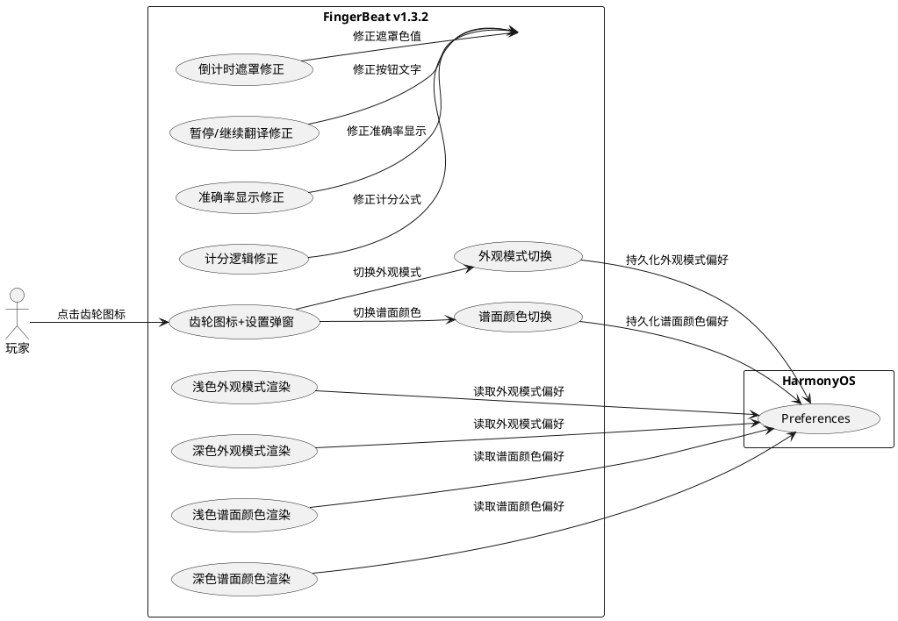
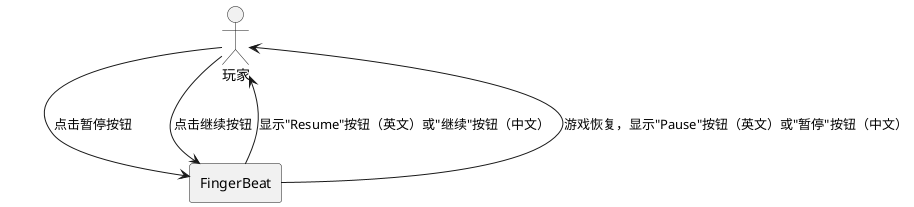
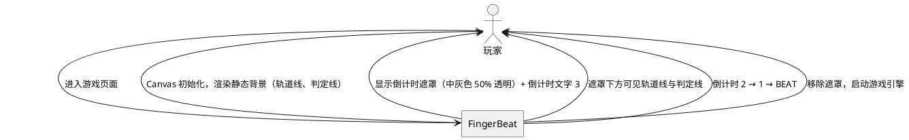
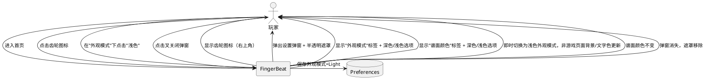
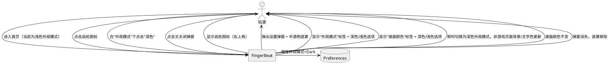
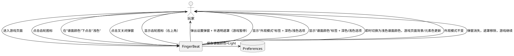
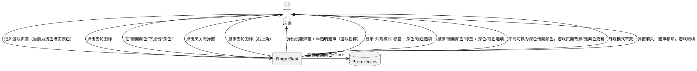

# **1. 组件定位**

## **1.1 核心职责**

本组件负责修复 FingerBeat v1.3.1 中存在的计分逻辑偏差、结算界面准确率计算错误、暂停/继续按钮英文翻译截断、倒计时遮罩色值与背景渲染问题，并新增外观模式与谱面颜色双独立配色方案（含设置弹窗入口、外观模式与谱面颜色各自深色/浅色切换）功能。

## **1.2 核心输入**

1. README 中定义的计分规则（分数权重与连击倍率阈值）作为计分逻辑修正的权威依据
2. ScoreSystem 输出的 accuracy 值（0-100 范围）作为结算界面准确率显示修正的依据
3. 用户在游戏界面点击暂停/继续按钮的操作事件
4. 倒计时等待界面的遮罩与背景渲染状态
5. 用户在任意页面（非游戏页面或游戏页面）右上角点击齿轮图标的操作事件
6. 用户在设置弹窗中切换外观模式（深色/浅色）的操作事件
7. 用户在设置弹窗中切换谱面颜色（深色/浅色）的操作事件
8. HarmonyOS 系统颜色模式配置（作为外观模式默认值判定依据）

## **1.3 核心输出**

1. 计分逻辑严格遵循 README 定义：分数权重 PERFECT=300、GREAT=200、GOOD=100、MISS=0；连击倍率 4+=1.1x、8+=1.2x、16+=1.3x、32+=1.4x、64+=1.5x
2. 结算界面准确率以百分比形式正确显示（如 85.5%）
3. 暂停按钮显示完整英文翻译"Pause"，继续按钮显示完整英文翻译"Resume"
4. 倒计时等待界面使用 rgb(128,128,128) 50% 不透明度半透明遮罩，且倒计时期间渲染游戏背景
5. 首页、曲目选择页及游戏页面右上角均显示极简描边轮廓齿轮图标
6. 点击齿轮图标弹出设置弹窗，弹窗内含"外观模式"标签及深色/浅色切换选项，以及"谱面颜色"标签及深色/浅色切换选项
7. 外观模式偏好与谱面颜色偏好各自独立持久化存储，切换后即时生效且互不影响
8. 浅色外观模式提供护眼的浅色配色方案，深色外观模式提供深色背景与浅色文字的配色方案（与现有一致）
9. 浅色谱面颜色提供护眼的浅色游戏界面配色方案，深色谱面颜色提供深色游戏界面配色方案（与现有一致）

## **1.4 职责边界**

1. 不负责 v1.3.0 spec 文档中计分规则的修正（仅在本需求内标注其与 README 的差异，实现以 README 为准）
2. 不负责游戏核心判定逻辑（JudgeSystem）的变更
3. 不负责游戏引擎（GameEngine）主循环或音频系统的变更
4. 不负责外观模式与谱面颜色以外的第三方主题或自定义颜色功能
5. 不负责设置弹窗中除"外观模式"与"谱面颜色"以外的其他设置项（未来版本扩展）

# **2. 领域术语**

**分数权重（Score Weight）**
: 各判定等级对应的基础分值，定义为 PERFECT=300、GREAT=200、GOOD=100、MISS=0，作为每次判定的基础计分依据。

**连击倍率（Combo Multiplier）**
: 根据当前连击数确定的分数乘数，阈值定义为：连击 4 及以上 = 1.1x、8+ = 1.2x、16+ = 1.3x、32+ = 1.4x、64+ = 1.5x；低于 4 连击时倍率为 1.0x。

**准确率（Accuracy）**
: 以满分（全 PERFECT 且无连击额外加分时的理论最高分）为基准，实际得分占满分的百分比，取值范围 [0, 100]。

**暂停（Pause）**
: 游戏进行中玩家主动触发的游戏暂停操作，英文翻译为"Pause"，中文翻译为"暂停"。

**继续（Resume）**
: 游戏暂停后玩家触发的恢复游戏操作，英文翻译为"Resume"，中文翻译为"继续"。

**倒计时遮罩（Countdown Overlay）**
: 游戏启动前覆盖在游戏画面上方的半透明遮罩层，用于在 3→2→1→BEAT 倒计时期间突出显示倒计时文字，同时保留游戏背景的可见性。

**外观（Appearance）**
: 应用的非游戏页面视觉配色方案，分为深色模式（Dark）和浅色模式（Light）两种，影响非游戏页面（首页、曲目选择页）的背景色、文字色、边框色等视觉元素。与谱面颜色独立，互不影响。

**浅色外观（Light Appearance）**
: 使用浅色背景与深色文字的护眼配色方案，与深色外观模式互为切换关系，仅覆盖非游戏页面（首页、曲目选择页）。

**深色外观（Dark Appearance）**
: 使用深色背景与浅色文字的配色方案，与浅色外观模式互为切换关系，为外观模式默认值，背景色 '#0D0D1A'，仅覆盖非游戏页面（首页、曲目选择页）。

**谱面颜色（Chart Color）**
: 游戏界面的视觉配色方案，分为深色谱面颜色（Dark）和浅色谱面颜色（Light）两种，影响游戏页面（GamePage）的背景色、音符色、轨道色、判定线色等视觉元素。与外观模式独立，互不影响。

**浅色谱面颜色（Light Chart Color）**
: 使用浅色背景与深色元素的护眼配色方案，与深色谱面颜色互为切换关系，仅覆盖游戏页面（GamePage）。

**深色谱面颜色（Dark Chart Color）**
: 使用深色背景与浅色元素的配色方案，与浅色谱面颜色互为切换关系，为谱面颜色默认值，仅覆盖游戏页面（GamePage）。

**设置弹窗（Settings Dialog）**
: 从任意页面（非游戏页面或游戏页面）右上角齿轮图标触发的圆角矩形弹窗，居中显示于屏幕，右上角有关闭按钮（叉），弹出时背景蒙半透明遮罩，v1.3.2 包含"外观模式"与"谱面颜色"两个设置标签。

**齿轮图标（Gear Icon）**
: 位于首页、曲目选择页及游戏页面右上角的极简描边轮廓风格图标，作为设置弹窗的入口触发器。

# **3. 角色与边界**

## **3.1 核心角色**

- **玩家**：操作应用的用户，可切换外观模式与谱面颜色、点击齿轮图标打开设置弹窗、在游戏界面使用暂停/继续功能、查看结算界面准确率

## **3.2 外部系统**

- **HarmonyOS Preferences API**：用于外观模式偏好与谱面颜色偏好的键值对持久化存储
- **HarmonyOS 系统 UI 上下文**：提供系统颜色模式配置作为外观模式默认值判定依据

## **3.3 交互上下文**

# **4. DFX约束**

## **4.1 性能**

1. 外观模式切换必须即时生效，不得出现闪烁或延迟
2. 谱面颜色切换必须即时生效，不得出现闪烁或延迟
3. 设置弹窗弹出/关闭动画必须流畅，时长不超过 300ms
4. 齿轮图标点击响应延迟不得超过 1 帧（16ms）

## **4.2 可靠性**

1. 外观模式偏好持久化失败时必须使用内存中的当前值，不得崩溃
2. 外观模式偏好读取失败时必须默认为深色外观模式
3. 谱面颜色偏好持久化失败时必须使用内存中的当前值，不得崩溃
4. 谱面颜色偏好读取失败时必须默认为深色谱面颜色
5. 计分逻辑修正后必须与 README 定义的规则完全一致

## **4.3 安全性**

1. 外观模式偏好与谱面颜色偏好均不涉及用户隐私数据
2. 设置弹窗不涉及网络通信

## **4.4 可维护性**

1. 外观模式配色方案必须集中管理，禁止散落的硬编码色值
2. 谱面颜色配色方案必须集中管理，禁止散落的硬编码色值
3. 设置弹窗的结构必须便于未来扩展更多设置项
4. 齿轮图标组件必须独立可复用

## **4.5 兼容性**

1. 深色外观模式与浅色外观模式必须功能完全兼容，无论从深色切换为浅色还是从浅色切换为深色，切换后所有非游戏页面正确渲染
2. 深色谱面颜色与浅色谱面颜色必须功能完全兼容，无论从深色切换为浅色还是从浅色切换为深色，切换后游戏页面正确渲染
3. 外观模式与谱面颜色的切换互不影响，切换任一方时另一方保持不变
4. 修正后的计分逻辑不得影响已有最高分记录的读取（仅影响新游戏结算）
5. 倒计时遮罩修正不得影响倒计时动画时序和游戏启动流程

# **5. 核心能力**

## **5.1 计分逻辑修正**

### **5.1.1 业务规则**

1. **分数权重一致性**：ScoreSystem 中各判定等级的分数权重必须与 README 定义完全一致

   a. 验收条件：When 判定等级为 PERFECT，the ScoreSystem shall 返回基础分 300；When 判定等级为 GREAT，the ScoreSystem shall 返回基础分 200；When 判定等级为 GOOD，the ScoreSystem shall 返回基础分 100；When 判定等级为 MISS，the ScoreSystem shall 返回基础分 0

2. **连击倍率阈值一致性**：ScoreSystem 中连击倍率的阈值与倍率值必须与 README 定义完全一致

   a. 验收条件：While 连击数 >= 4 且 < 8，the ScoreSystem shall 使用倍率 1.1x；While 连击数 >= 8 且 < 16，the ScoreSystem shall 使用倍率 1.2x；While 连击数 >= 16 且 < 32，the ScoreSystem shall 使用倍率 1.3x；While 连击数 >= 32 且 < 64，the ScoreSystem shall 使用倍率 1.4x；While 连击数 >= 64，the ScoreSystem shall 使用倍率 1.5x；While 连击数 < 4，the ScoreSystem shall 使用倍率 1.0x

3. **计分公式一致性**：每次判定的分数增量必须等于 floor(基础分 × 连击倍率)，总分累加该增量

   a. 验收条件：When 玩家获得判定且连击数为 5，the ScoreSystem shall 计算增量为 floor(基础分 × 1.1)

4. **v1.3.0 spec 计分规则标注**：v1.3.0 版本文档中关于连击倍率阈值的描述与 README 不一致，必须修正为与 README 一致的阈值（4+=1.1x, 8+=1.2x, 16+=1.3x, 32+=1.4x, 64+=1.5x）。涉及以下文件及位置：
   - v1_3_refactor/spec.md 第 5.3.1 节第 5 条"评分计算"（原描述：10连=1.1x, 30连=1.2x, 50连=1.3x）— **已修正**
   - v1_3_refactor/design.md 第 1.3.3 节 ScoreSystem"连击倍率"描述（原描述：10连=1.1x, 30连=1.2x, 50连=1.3x）— **已修正**
   - v1_3_refactor/design.md 常量配置 COMBO_MULTIPLIERS（原阈值：50→1.3, 30→1.2, 10→1.1）— **已修正**
   - v1_3_refactor/tasks.md 任务 4.3 ScoreSystem 实现描述（原描述：10连=1.1x, 30连=1.2x, 50连=1.3x）— **已修正**

   a. 验收条件：When 审阅 v1_3_refactor/ 中所有文档的评分计算相关描述，the documents shall 显示连击倍率阈值为 4+/8+/16+/32+/64+ 对应 1.1x/1.2x/1.3x/1.4x/1.5x

### **5.1.2 交互流程**

无用户交互（纯逻辑修正）

### **5.1.3 异常场景**

无（计分逻辑修正是确定性的公式对齐，不引入新的异常路径）

## **5.2 结算界面准确率计算修正**

### **5.2.1 业务规则**

1. **准确率数值范围定义**：ScoreSystem.getAccuracy() 返回的 accuracy 值范围为 [0, 100]，表示百分比数值

   a. 验收条件：When ScoreSystem 计算准确率，the ScoreSystem shall 返回 (实际得分 / 理论满分) × 100，结果范围 [0, 100]

2. **结算界面准确率显示**：ResultOverlay 中准确率必须直接使用 accuracy 值并以一位小数百分比格式显示，不得二次乘以 100

   a. 验收条件：When accuracy 值为 85.5，the ResultOverlay shall 显示"85.5%"；When accuracy 值为 100，the ResultOverlay shall 显示"100.0%"

3. **禁止双重百分比转换**：ResultOverlay 中准确率的显示公式必须为 `${accuracy.toFixed(1)}%`，不得为 `${(accuracy * 100).toFixed(1)}%`

   a. 验收条件：When accuracy 值为 50.0，the ResultOverlay shall 显示"50.0%"而非"5000.0%"

### **5.2.2 交互流程**

无用户交互（纯显示逻辑修正）

### **5.2.3 异常场景**

1. **准确率为 NaN 或 Infinity**

   a. 触发条件：totalNoteCount 为 0 导致除零

   b. 系统行为：返回 0，显示"0.0%"

   c. 用户感知：结算界面显示"0.0%"，不崩溃

## **5.3 暂停/继续按钮英文翻译修正**

### **5.3.1 业务规则**

1. **暂停按钮英文文本**：当界面语言为英文时，暂停按钮必须显示完整单词"Pause"

   a. 验收条件：While 界面语言为 en 且游戏处于进行中，the 暂停按钮 shall 显示文本"Pause"

2. **继续按钮英文文本**：当界面语言为英文时，继续按钮必须显示完整单词"Resume"

   a. 验收条件：While 界面语言为 en 且游戏处于暂停状态，the 继续按钮 shall 显示文本"Resume"

3. **暂停按钮中文文本**：当界面语言为中文时，暂停按钮必须显示"暂停"

   a. 验收条件：While 界面语言为 zh 且游戏处于进行中，the 暂停按钮 shall 显示文本"暂停"

4. **继续按钮中文文本**：当界面语言为中文时，继续按钮必须显示"继续"

   a. 验收条件：While 界面语言为 zh 且游戏处于暂停状态，the 继续按钮 shall 显示文本"继续"

5. **按钮尺寸适配**：暂停/继续按钮的宽度必须能够完整显示英文"Resume"（最长的翻译文本）而不截断

   a. 验收条件：When 界面语言为 en，the 暂停/继续按钮 shall 完整显示"Resume"文本，无截断、无省略号

6. **翻译词条一致性**：暂停和继续的翻译词条（pause_label / resume_label）在 LanguageManager 的英文翻译中必须分别为"Pause"和"Resume"

   a. 验收条件：When 查询 LanguageManager 英文翻译的 pause_label，the LanguageManager shall 返回"Pause"；When 查询 resume_label，the LanguageManager shall 返回"Resume"

### **5.3.2 交互流程**

### **5.3.3 异常场景**

无（翻译文本为静态配置，按钮尺寸为固定布局，无运行时异常路径）

## **5.4 倒计时页面遮罩修正**

### **5.4.1 业务规则**

1. **遮罩颜色**：倒计时等待界面的半透明遮罩必须使用 rgb(128, 128, 128) 即中灰色

   a. 验收条件：When 倒计时等待界面显示，the 遮罩 shall 使用 RGB 色值 (128, 128, 128)

2. **遮罩不透明度**：倒计时遮罩的不透明度必须为 50%

   a. 验收条件：When 倒计时等待界面显示，the 遮罩 shall 具有 50% 不透明度（alpha = 0.5）

3. **遮罩不阻挡游戏背景**：倒计时期间必须正常渲染游戏背景（包含轨道线、判定线等静态元素），遮罩仅作为半透明覆盖层叠加在背景之上

   a. 验收条件：While 倒计时进行中，the 游戏画面 shall 渲染轨道分隔线和判定线，遮罩覆盖其上方形成半透明效果

4. **倒计时期间游戏引擎未启动**：倒计时期间游戏引擎尚未启动主循环，此时画面需渲染静态游戏背景元素（轨道线、判定线），但不渲染音符块

   a. 验收条件：While 倒计时进行中且游戏引擎未启动，the 游戏画面 shall 显示轨道分隔线和判定线，不显示下落音符块

### **5.4.2 交互流程**

### **5.4.3 异常场景**

1. **Canvas 未就绪时倒计时开始**

   a. 触发条件：Canvas onReady 事件延迟，倒计时在 Canvas 渲染能力就绪前启动

   b. 系统行为：等待 Canvas 就绪后再启动倒计时（与现有 tryStartGame 逻辑一致）

   c. 用户感知：短暂延迟后倒计时正常开始

## **5.5 外观模式与谱面颜色双独立配色方案设计**

### **5.5.1 业务规则**

#### 齿轮图标与设置弹窗

1. **齿轮图标位置（非游戏页面）**：在首页（Index）和曲目选择页（SongSelectPage）的右上角必须显示一个齿轮图标

   a. 验收条件：When 玩家位于首页或曲目选择页，the 页面右上角 shall 显示齿轮图标

2. **齿轮图标位置（游戏页面）**：在游戏页面（GamePage）的右上角也必须显示一个齿轮图标

   a. 验收条件：When 玩家位于游戏页面，the 页面右上角 shall 显示齿轮图标

3. **齿轮图标样式**：齿轮图标必须采用极简描边轮廓风格，无填充色，线条颜色与当前外观模式下的主文字色一致

   a. 验收条件：When 当前为深色外观模式，the 齿轮图标 shall 使用浅色描边；When 当前为浅色外观模式，the 齿轮图标 shall 使用深色描边

4. **齿轮图标尺寸**：齿轮图标必须适中大小，易于点击，不遮挡其他页面元素

   a. 验收条件：When 玩家点击齿轮图标区域，the 设置弹窗 shall 正确弹出

5. **设置弹窗触发**：点击齿轮图标必须弹出设置弹窗，弹窗以圆角矩形框的形式显示在屏幕中央

   a. 验收条件：When 玩家在非游戏页面点击齿轮图标，the 应用 shall 在屏幕中央显示设置弹窗；When 玩家在游戏页面点击齿轮图标，the 应用 shall 在屏幕中央显示设置弹窗

6. **设置弹窗关闭按钮**：设置弹窗的右上角必须有一个叉（×）图标，点击关闭弹窗

   a. 验收条件：When 玩家点击弹窗右上角叉图标，the 设置弹窗 shall 关闭并消失

7. **设置弹窗半透明遮罩**：设置弹窗弹出时，背景必须蒙上与倒计时等待界面相同的半透明遮罩（rgb(128,128,128)，不透明度 50%）

   a. 验收条件：When 设置弹窗弹出，the 页面背景 shall 覆盖中灰色 50% 透明遮罩

8. **设置弹窗可扩展性**：设置弹窗的结构必须支持未来版本添加更多设置标签与开关

   a. 验收条件：Where 未来需要新增设置项，the 设置弹窗结构 shall 允许在"谱面颜色"标签下方追加新标签，不影响现有布局

#### 外观模式

9. **外观模式标签**：设置弹窗内第一个标签必须为"外观模式"（中文）或"Appearance"（英文）

   a. 验收条件：While 界面语言为 zh，the 设置弹窗 shall 显示标签"外观模式"；While 界面语言为 en，the 设置弹窗 shall 显示标签"Appearance"

10. **外观模式选项**：外观模式标签下必须提供"深色 / Dark"和"浅色 / Light"两个可选项，以圆角矩形样式呈现

    a. 验收条件：When 界面语言为 zh，the 外观模式选项 shall 显示"深色"和"浅色"；When 界面语言为 en，the 外观模式选项 shall 显示"Dark"和"Light"

11. **外观模式选项样式**：深色/浅色选项必须采用圆角矩形样式，与语言切换按钮风格相似——透明填充、文字颜色与边框颜色一致、选中状态为填充背景色+对比文字色

    a. 验收条件：When 当前外观模式为深色，the "深色"选项 shall 呈选中态（填充背景色+对比文字色），the "浅色"选项 shall 呈未选中态（透明填充+描边文字）；When 当前外观模式为浅色，the "浅色"选项 shall 呈选中态（填充背景色+对比文字色），the "深色"选项 shall 呈未选中态（透明填充+描边文字）

12. **外观模式切换逻辑**：点击"浅色"切换为浅色外观模式，点击"深色"切换为深色外观模式，切换后即时生效

    a. 验收条件：When 玩家点击"浅色"选项，the 应用 shall 即时切换为浅色外观模式；When 玩家点击"深色"选项，the 应用 shall 即时切换为深色外观模式

13. **外观模式持久化**：外观模式偏好必须通过 HarmonyOS Preferences 持久化存储，应用重启后恢复上次选择

    a. 验收条件：When 玩家切换为浅色外观模式后关闭应用再打开，the 应用 shall 以浅色外观模式启动；When 玩家切换为深色外观模式后关闭应用再打开，the 应用 shall 以深色外观模式启动

14. **默认外观模式**：首次启动时外观模式默认为深色外观模式

    a. 验收条件：When 无外观模式持久化偏好记录，the 应用 shall 以深色外观模式启动

15. **浅色外观模式配色方案**：浅色外观模式必须使用护眼的浅色背景与深色文字配色

    a. 验收条件：When 浅色外观模式启用，the 非游戏页面背景 shall 使用浅色色值、文字 shall 使用深色色值，确保对比度满足 WCAG 2.1 标准（≥4.5:1）

16. **深色外观模式配色方案**：深色外观模式必须使用深色背景与浅色文字配色

    a. 验收条件：When 深色外观模式启用，the 非游戏页面背景 shall 使用深色色值、文字 shall 使用浅色色值，确保对比度满足 WCAG 2.1 标准（≥4.5:1）

17. **外观模式覆盖范围**：外观模式的配色仅覆盖非游戏页面（首页、曲目选择页），不影响游戏页面配色

    a. 验收条件：When 浅色外观模式启用且玩家进入游戏页面，the 游戏页面 shall 使用谱面颜色配色方案渲染，不受外观模式影响；When 深色外观模式启用且玩家进入游戏页面，the 游戏页面 shall 使用谱面颜色配色方案渲染，不受外观模式影响

#### 谱面颜色

18. **谱面颜色标签**：设置弹窗内第二个标签必须为"谱面颜色"（中文）或"Chart Color"（英文）

    a. 验收条件：While 界面语言为 zh，the 设置弹窗 shall 显示标签"谱面颜色"；While 界面语言为 en，the 设置弹窗 shall 显示标签"Chart Color"

19. **谱面颜色选项**：谱面颜色标签下必须提供"深色 / Dark"和"浅色 / Light"两个可选项，以圆角矩形样式呈现

    a. 验收条件：When 界面语言为 zh，the 谱面颜色选项 shall 显示"深色"和"浅色"；When 界面语言为 en，the 谱面颜色选项 shall 显示"Dark"和"Light"

20. **谱面颜色选项样式**：深色/浅色选项必须采用圆角矩形样式，与外观模式选项风格一致——透明填充、文字颜色与边框颜色一致、选中状态为填充背景色+对比文字色

    a. 验收条件：When 当前谱面颜色为深色，the "深色"选项 shall 呈选中态（填充背景色+对比文字色），the "浅色"选项 shall 呈未选中态（透明填充+描边文字）；When 当前谱面颜色为浅色，the "浅色"选项 shall 呈选中态（填充背景色+对比文字色），the "深色"选项 shall 呈未选中态（透明填充+描边文字）

21. **谱面颜色切换逻辑**：点击"浅色"切换为浅色谱面颜色，点击"深色"切换为深色谱面颜色，切换后即时生效

    a. 验收条件：When 玩家点击"浅色"选项，the 应用 shall 即时切换为浅色谱面颜色；When 玩家点击"深色"选项，the 应用 shall 即时切换为深色谱面颜色

22. **谱面颜色持久化**：谱面颜色偏好必须通过 HarmonyOS Preferences 持久化存储，应用重启后恢复上次选择

    a. 验收条件：When 玩家切换为浅色谱面颜色后关闭应用再打开，the 应用 shall 以浅色谱面颜色启动；When 玩家切换为深色谱面颜色后关闭应用再打开，the 应用 shall 以深色谱面颜色启动

23. **默认谱面颜色**：首次启动时谱面颜色默认为深色谱面颜色

    a. 验收条件：When 无谱面颜色持久化偏好记录，the 应用 shall 以深色谱面颜色启动

24. **浅色谱面颜色配色方案**：浅色谱面颜色必须使用护眼的浅色背景与深色元素配色

    a. 验收条件：When 浅色谱面颜色启用，the 游戏页面背景 shall 使用浅色色值、音符与轨道等元素 shall 使用深色色值，确保对比度满足 WCAG 2.1 标准（≥4.5:1）

25. **深色谱面颜色配色方案**：深色谱面颜色必须使用深色背景与浅色元素配色

    a. 验收条件：When 深色谱面颜色启用，the 游戏页面背景 shall 使用深色色值、音符与轨道等元素 shall 使用浅色色值，确保对比度满足 WCAG 2.1 标准（≥4.5:1）

26. **谱面颜色覆盖范围**：谱面颜色的配色仅覆盖游戏页面（GamePage），不影响非游戏页面配色

    a. 验收条件：When 浅色谱面颜色启用且玩家位于首页，the 首页 shall 使用外观模式配色方案渲染，不受谱面颜色影响；When 深色谱面颜色启用且玩家位于首页，the 首页 shall 使用外观模式配色方案渲染，不受谱面颜色影响

#### 独立性

27. **外观模式与谱面颜色独立性**：外观模式的切换不得影响谱面颜色的当前值，谱面颜色的切换不得影响外观模式的当前值

    a. 验收条件：When 当前谱面颜色为浅色且玩家将外观模式从深色切换为浅色，the 谱面颜色 shall 保持为浅色不变；When 当前外观模式为浅色且玩家将谱面颜色从深色切换为浅色，the 外观模式 shall 保持为浅色不变

28. **外观模式与谱面颜色持久化独立性**：外观模式与谱面颜色使用不同的持久化键，一方保存失败不影响另一方

    a. 验收条件：When 外观模式偏好保存失败，the 谱面颜色偏好保存 shall 不受影响；When 谱面颜色偏好保存失败，the 外观模式偏好保存 shall 不受影响

### **5.5.2 交互流程**

**切换为浅色外观模式：**

**切换为深色外观模式：**

**切换为浅色谱面颜色：**

**切换为深色谱面颜色：**

### **5.5.3 异常场景**

1. **外观模式偏好读取失败**

   a. 触发条件：Preferences API 读取外观模式键异常

   b. 系统行为：默认使用深色外观模式，记录错误日志

   c. 用户感知：非游戏页面以深色外观模式显示

2. **外观模式偏好保存失败**

   a. 触发条件：Preferences API 写入外观模式键异常

   b. 系统行为：当前会话中外观模式即时生效，但不持久化，记录错误日志

   c. 用户感知：当前切换成功，但下次启动恢复为深色外观模式

3. **谱面颜色偏好读取失败**

   a. 触发条件：Preferences API 读取谱面颜色键异常

   b. 系统行为：默认使用深色谱面颜色，记录错误日志

   c. 用户感知：游戏页面以深色谱面颜色显示

4. **谱面颜色偏好保存失败**

   a. 触发条件：Preferences API 写入谱面颜色键异常

   b. 系统行为：当前会话中谱面颜色即时生效，但不持久化，记录错误日志

   c. 用户感知：当前切换成功，但下次启动恢复为深色谱面颜色

5. **齿轮图标与语言切换按钮位置冲突**

   a. 触发条件：首页左上角已有语言切换按钮，右上角齿轮图标布局空间不足

   b. 系统行为：齿轮图标定位在右上角，语言切换按钮保持在左上角，两者分居两侧

   c. 用户感知：两个按钮分别位于左上角和右上角，无重叠

6. **游戏页面打开设置弹窗时游戏状态**

   a. 触发条件：玩家在游戏进行中点击齿轮图标打开设置弹窗

   b. 系统行为：游戏暂停，弹出设置弹窗；关闭弹窗后游戏继续

   c. 用户感知：弹窗弹出时游戏暂停，关闭弹窗后游戏恢复

# **6. 数据约束**

## **6.1 外观模式偏好（AppearanceModePreference）**

1. **key**：持久化存储的键名，固定字符串 "appearance_mode"
2. **value**：外观模式值，取值为 "dark" 或 "light"，默认 "dark"
3. **store**：所属 Preferences 存储名称，与现有设置存储一致

## **6.2 谱面颜色偏好（ChartColorPreference）**

1. **key**：持久化存储的键名，固定字符串 "chart_color"
2. **value**：谱面颜色值，取值为 "dark" 或 "light"，默认 "dark"
3. **store**：所属 Preferences 存储名称，与现有设置存储一致
4. **独立性约束**：chart_color 的键名必须与 appearance_mode 的键名不同，两者独立读写

## **6.3 浅色外观模式配色方案（LightAppearanceModeColors）**

1. **背景色**：浅色外观模式页面背景色，必须为浅色色值（如 '#F5F5F5' 或同等明度的护眼浅色）
2. **主文字色**：浅色外观模式下的主文字颜色，必须为深色色值，与背景色对比度 ≥ 4.5:1
3. **次文字色**：浅色外观模式下的辅助文字颜色，必须为中等深色色值
4. **轨道/分割线色**：浅色外观模式下曲目列表分割线、轨道等装饰元素颜色
5. **选中项背景色**：浅色外观模式下选中态的背景填充色
6. **选中项文字色**：浅色外观模式下选中态的文字颜色

## **6.4 深色外观模式配色方案（DarkAppearanceModeColors）**

1. **背景色**：深色外观模式页面背景色，'#0D0D1A'（与现有一致）
2. **主文字色**：深色外观模式下的主文字颜色，'#FFFFFF'，与背景色对比度 ≥ 4.5:1
3. **次文字色**：深色外观模式下的辅助文字颜色，'#AAAAAA'
4. **轨道/分割线色**：深色外观模式下曲目列表分割线、轨道等装饰元素颜色，'#333366'
5. **选中项背景色**：深色外观模式下选中态的背景填充色，各难度对应颜色（Easy='#00FF00', Normal='#FFD700', Hard='#FF4500'）
6. **选中项文字色**：深色外观模式下选中态的文字颜色，'#0D0D1A'

## **6.5 浅色谱面颜色配色方案（LightChartColorColors）**

1. **背景色**：浅色谱面颜色游戏页面背景色，必须为浅色色值（如 '#F5F5F5' 或同等明度的护眼浅色）
2. **音符色**：浅色谱面颜色下的音符颜色，必须为深色色值，与背景色对比度 ≥ 4.5:1
3. **轨道线色**：浅色谱面颜色下的轨道分隔线颜色
4. **判定线色**：浅色谱面颜色下的判定线颜色
5. **文字色**：浅色谱面颜色下的分数、连击等文字颜色，必须为深色色值

## **6.6 深色谱面颜色配色方案（DarkChartColorColors）**

1. **背景色**：深色谱面颜色游戏页面背景色，'#0D0D1A'（与现有一致）
2. **音符色**：深色谱面颜色下的音符颜色，各难度对应颜色（与现有一致）
3. **轨道线色**：深色谱面颜色下的轨道分隔线颜色，'#333366'
4. **判定线色**：深色谱面颜色下的判定线颜色
5. **文字色**：深色谱面颜色下的分数、连击等文字颜色，'#FFFFFF'

## **6.7 倒计时遮罩参数（CountdownOverlayParams）**

1. **遮罩 RGB 色值**：(128, 128, 128)，即中灰色
2. **遮罩不透明度**：50%，即 alpha = 0.5
3. **十六进制表示**：'#80808080'（ARGB 格式，前两位为 alpha 0x80=128≈50%，后六位为 RGB 808080=128,128,128）

## **6.8 计分参数（ScoreParams）**

1. **SCORE_WEIGHT_PERFECT**：300
2. **SCORE_WEIGHT_GREAT**：200
3. **SCORE_WEIGHT_GOOD**：100
4. **SCORE_WEIGHT_MISS**：0
5. **COMBO_MULTIPLIER 阈值序列**：[{threshold: 64, multiplier: 1.5}, {threshold: 32, multiplier: 1.4}, {threshold: 16, multiplier: 1.3}, {threshold: 8, multiplier: 1.2}, {threshold: 4, multiplier: 1.1}]，低于 4 连击时倍率为 1.0

## **6.9 准确率显示格式（AccuracyDisplayFormat）**

1. **数值范围**：[0, 100]，由 ScoreSystem.getAccuracy() 直接返回
2. **显示格式**：`${accuracy.toFixed(1)}%`，保留一位小数
3. **禁止操作**：不得在显示时再次乘以 100
