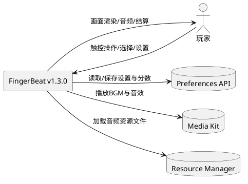
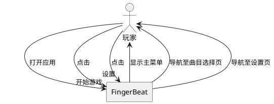
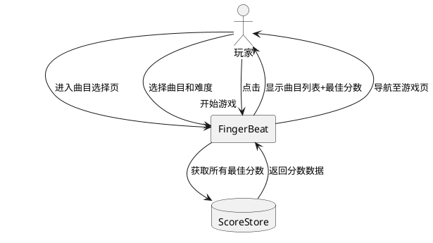
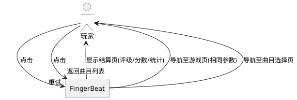
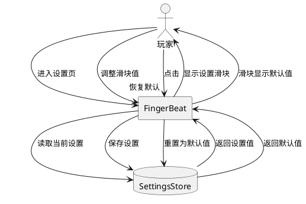

# **1. 组件定位**

## **1.1 核心职责**

本组件负责重构 FingerBeat 音乐节奏游戏，在保持 v1.2.0 全部功能的基础上，完全重构代码以修复问题，实现高度模块化和可扩展性。

## **1.2 核心输入**

1. 玩家在游戏页面的触控操作（点击轨道、暂停/继续/退出）
2. 玩家在曲目选择页面的选择操作（选择曲目、选择难度）
3. 玩家在设置页面的配置操作（调整音量、下落速度、恢复默认）
4. 玩家在结算页面的操作（重试、返回曲目列表）
5. 内置谱面数据（3首曲目 x 3个难度 = 9个谱面）
6. 持久化存储的设置数据和分数数据

## **1.3 核心输出**

1. 游戏画面渲染（音符下落、判定反馈、分数/连击显示）
2. 音频输出（背景音乐播放、命中/未命中音效）
3. 游戏结算结果（分数、准确率、评级、判定统计）
4. 最佳分数持久化存储
5. 用户设置持久化存储

## **1.4 职责边界**

1. 不负责在线多人游戏功能
2. 不负责音乐文件的编辑或生成
3. 不负责应用内购买或付费功能
4. 不负责社交分享功能的实际网络通信（v1.3.0 仅预留接口）
5. 不负责官方关卡后台下载的实际网络通信（v1.3.0 仅预留接口）
6. 不负责玩家导入音乐的实际音频分析（v1.3.0 仅预留接口）
7. 不负责谱面编辑器的完整实现（v1.3.0 仅预留接口和数据结构）
8. 不负责多人在线游戏的完整实现（v1.3.0 仅预留接口和数据结构）

# **2. 领域术语**

**谱面 (Beatmap)**
: 一首曲目在特定难度下的音符排列序列，包含音符的时间、轨道、类型等信息。

**音符 (Note)**
: 谱面中的单个交互元素，玩家需在音符到达判定线时进行操作。当前支持 TAP（点击）类型，预留 HOLD（长按）和 SLIDE（滑动）类型。

**判定线 (Judgment Line)**
: 游戏画面中固定位置的横线，音符下落至此线时为最佳操作时机。

**判定等级 (Judgment Grade)**
: 根据玩家操作时机与音符目标时间的偏差划分的等级，包括 PERFECT、GREAT、GOOD、MISS 四级。

**字母评级 (Letter Grade)**
: 游戏结算时根据准确率给出的总体评价，包括 S、A、B、C、D 五级。

**连击 (Combo)**
: 玩家连续获得非 MISS 判定的次数。

**曲目 (Song)**
: 一首可供游玩的音乐，包含标题、艺术家、BPM、时长、音频文件等信息，以及多个难度的谱面。

**难度 (Difficulty)**
: 谱面的难度等级，分为 Easy、Normal、Hard 三级。

**轨道 (Lane)**
: 音符下落的垂直通道，默认 4 条轨道。

**曲目来源 (Song Source)**
: 曲目的来源分类，包括 BUILTIN（内置）、OFFICIAL_UPDATE（官方更新，预留）、PLAYER_IMPORT（玩家导入，预留）。

**关卡包 (Beatmap Package)**
: 包含曲目信息、全部难度谱面、音频文件和封面图片的完整打包格式，用于导入/导出/分享功能（预留）。

**游戏引擎 (Game Engine)**
: 协调判定系统、评分系统、音符调度器、音频播放器的核心控制器。

**判定窗口 (Judgment Window)**
: 各判定等级允许的时间偏差范围，以毫秒为单位，不同难度有不同窗口大小。

**下落速度 (Scroll Speed)**
: 音符从出现到到达判定线的移动速度，受难度倍率和玩家设置共同影响。

**谱面编辑器 (Beatmap Editor)**
: 允许玩家基于导入的音乐自设计关卡的工具，包含音符放置、时间轴编辑、预览试玩等功能（预留）。

**多人游戏 (Multiplayer)**
: 多名玩家在线同步游玩同一谱面的模式，包含房间创建/加入、实时状态同步、多人结算排行等功能（预留）。

**游戏模式 (Game Mode)**
: 游戏的玩法模式分类，当前为单人标准模式，预留多人对战模式、多人协作模式等。

# **3. 角色与边界**

## **3.1 核心角色**

- **玩家**：选择曲目和难度、在游戏页面进行触控操作、查看结算结果、调整游戏设置
- **开发者**：通过预留的扩展接口添加官方关卡、实现导入导出功能

## **3.2 外部系统**

- **HarmonyOS Preferences API**：用于游戏设置和最佳分数的键值对持久化存储
- **HarmonyOS Media Kit (AVPlayer)**：用于背景音乐和音效的播放
- **HarmonyOS Resource Manager**：用于加载音频资源文件

## **3.3 交互上下文**



# **4. DFX约束**

## **4.1 性能**

1. 游戏循环必须以约 60FPS（16ms 间隔）运行
2. 音符位置更新延迟不得超过 1 帧（16ms）
3. 触控响应到判定反馈的延迟不得超过 2 帧（32ms）
4. 页面切换动画必须流畅，不得出现卡顿

## **4.2 可靠性**

1. 音频初始化失败时，游戏必须仍可正常运行（降级为系统时间追踪）
2. 持久化存储读写失败时，必须使用默认值而非崩溃
3. 游戏异常退出时不得丢失已保存的最佳分数和设置
4. 游戏循环必须正确检测并处理所有 MISS 音符

## **4.3 安全性**

1. 不涉及用户隐私数据收集
2. 不涉及网络通信（v1.3.0）
3. 持久化数据仅包含游戏分数和设置，无敏感信息

## **4.4 可维护性**

1. 代码必须高度模块化，各子系统（判定、评分、调度、音频）独立可测试
2. 必须使用统一的日志系统（hilog 封装）
3. 常量必须集中管理，禁止魔法数字
4. 类型定义必须集中管理，禁止散落的内联类型

## **4.5 兼容性**

1. 必须兼容 HarmonyOS SDK 5.0.5(17) 及以上
2. 目标 SDK 为 HarmonyOS 6.0.2(22)
3. 必须支持 phone、tablet、2in1 三种设备类型
4. 必须支持暗色模式
5. 必须支持中英文国际化

# **5. 核心能力**

## **5.1 主菜单导航**

### **5.1.1 业务规则**

1. **入口展示**：应用启动后必须展示主菜单页面，包含应用图标、标题"FingerBeat"、副标题和"开始游戏"按钮、"设置"按钮

   a. 验收条件：[应用启动] → [显示主菜单页面，包含所有上述元素]

2. **开始游戏导航**：点击"开始游戏"必须导航至曲目选择页面

   a. 验收条件：[点击"开始游戏"] → [导航至曲目选择页面]

3. **设置导航**：点击"设置"必须导航至设置页面

   a. 验收条件：[点击"设置"] → [导航至设置页面]

4. **页面导航方式**：必须使用 Navigation + NavPathStack 实现页面导航

   a. 验收条件：[所有页面跳转] → [通过 NavPathStack 推入/弹出]

### **5.1.2 交互流程**



### **5.1.3 异常场景**

1. **页面导航失败**

   a. 触发条件：NavPathStack 路由配置错误或页面不存在

   b. 系统行为：记录错误日志，保持当前页面

   c. 用户感知：页面不跳转，无崩溃

## **5.2 曲目选择**

### **5.2.1 业务规则**

1. **曲目列表展示**：必须展示所有内置曲目的列表，每项包含标题、艺术家、各难度最佳分数

   a. 验收条件：[进入曲目选择页] → [显示3首内置曲目的完整信息]

2. **难度选择**：必须提供 Easy、Normal、Hard 三个难度选择按钮，默认选中 Easy

   a. 验收条件：[选择曲目后] → [显示三个难度按钮，Easy 默认选中]

3. **最佳分数展示**：每首曲目每个难度旁必须显示历史最佳分数（如无记录则显示"--"）

   a. 验收条件：[存在历史分数] → [显示最佳分数]；[无历史分数] → [显示"--"]

4. **开始游戏**：选中曲目和难度后，点击"开始游戏"必须导航至游戏页面，传递曲目ID和难度

   a. 验收条件：[选中曲目+难度，点击开始] → [导航至游戏页，携带正确参数]

5. **返回主菜单**：必须提供返回主菜单的操作

   a. 验收条件：[点击返回] → [导航回主菜单]

### **5.2.2 交互流程**



### **5.2.3 异常场景**

1. **分数数据读取失败**

   a. 触发条件：Preferences API 读取异常

   b. 系统行为：使用默认值（"--"），记录错误日志

   c. 用户感知：最佳分数显示"--"，不影响游玩

## **5.3 游戏进行**

### **5.3.1 业务规则**

1. **游戏初始化**：进入游戏页必须根据传入的曲目ID和难度初始化游戏引擎，加载对应谱面和音频

   a. 验收条件：[进入游戏页] → [游戏引擎初始化，谱面加载，BGM开始播放]

2. **音符下落**：音符必须从屏幕顶部向下匀速移动至判定线位置，速度由基础速度 x 难度倍率 x 玩家设置共同决定

   a. 验收条件：[游戏进行中] → [音符按计算速度匀速下落]

3. **轨道触控**：玩家点击轨道时，必须在判定窗口内查找该轨道最近的未判定 TAP 音符进行判定

   a. 验收条件：[点击轨道] → [判定最近音符，显示判定结果和分数增量]

4. **判定等级**：根据时间偏差绝对值判定等级，窗口大小因难度而异

   a. 验收条件：[偏差 <= perfectWindow] → [PERFECT]；[偏差 <= greatWindow] → [GREAT]；[偏差 <= goodWindow] → [GOOD]；[偏差 > goodWindow] → [MISS]

5. **评分计算**：分数 = 基础分(Perfect=300, Great=200, Good=100, Miss=0) x 连击倍率(10连=1.1x, 30连=1.2x, 50连=1.3x)

   a. 验收条件：[获得判定] → [按公式计算分数增量并累加]

6. **连击机制**：连续非 MISS 判定累加连击数，MISS 重置为 0

   a. 验收条件：[非MISS判定] → [连击+1]；[MISS判定] → [连击归零]

7. **MISS 自动检测**：超过 goodWindow 仍未操作的 TAP 音符必须自动判定为 MISS

   a. 验收条件：[音符超时未操作] → [自动判定MISS，连击归零]

8. **音效播放**：命中时播放 sfx_hit 音效，MISS 时播放 sfx_miss 音效

   a. 验收条件：[命中判定] → [播放sfx_hit]；[MISS判定] → [播放sfx_miss]

9. **暂停功能**：点击暂停按钮必须暂停游戏循环和BGM，显示暂停菜单

   a. 验收条件：[点击暂停] → [游戏循环停止，BGM暂停，显示暂停菜单]

10. **继续功能**：暂停菜单中点击"继续"必须恢复游戏循环和BGM

    a. 验收条件：[点击继续] → [游戏循环恢复，BGM恢复]

11. **退出功能**：暂停菜单中点击"退出"必须释放资源并返回曲目选择页

    a. 验收条件：[点击退出] → [资源释放，导航回曲目选择页]

12. **系统返回键拦截**：按下系统返回键必须触发暂停而非直接退出

    a. 验收条件：[按系统返回键] → [触发暂停菜单]

13. **游戏结束**：所有音符判定完毕后必须自动结束游戏，生成结算结果，保存最佳分数，导航至结算页

    a. 验收条件：[所有音符判定完毕] → [生成GameResult，保存最佳分数，导航至结算页]

14. **判定视觉反馈**：PERFECT/GREAT 显示扩散爆炸特效，GOOD 显示轻微缩放特效，MISS 显示红色文字

    a. 验收条件：[获得判定] → [显示对应视觉特效]

15. **轨道高亮**：点击轨道时必须短暂高亮该轨道（100ms）

    a. 验收条件：[点击轨道] → [轨道高亮100ms后恢复]

### **5.3.2 交互流程**

```plantuml
@startuml
actor "玩家" as Player
rectangle "FingerBeat" as App
database "GameEngine" as Engine
database "AudioPlayer" as Audio

Player -> App : 进入游戏页
App -> Engine : 初始化(曲目ID, 难度)
Engine -> Audio : 加载并播放BGM
App --> Player : 显示游戏画面

loop 游戏循环
    Engine -> App : 更新音符位置
    App --> Player : 渲染音符下落
end

Player -> App : 点击轨道
App -> Engine : 处理轨道触控
Engine --> App : 返回判定结果+分数增量
App -> Audio : 播放音效
App --> Player : 显示判定特效+分数更新

Engine -> App : 检测MISS音符
App --> Player : 显示MISS判定

Engine -> App : 所有音符判定完毕
App -> Engine : 生成GameResult
App -> Audio : 停止BGM
App --> Player : 导航至结算页
@enduml
```

### **5.3.3 异常场景**

1. **音频初始化失败**

   a. 触发条件：AVPlayer 创建或资源加载失败

   b. 系统行为：降级为系统时间追踪，游戏循环正常运行

   c. 用户感知：无BGM和音效，游戏可正常进行

2. **谱面数据缺失**

   a. 触发条件：请求的曲目ID或难度对应的谱面不存在

   b. 系统行为：记录错误日志，返回曲目选择页

   c. 用户感知：提示"谱面加载失败"，返回曲目选择页

3. **游戏循环异常**

   a. 触发条件：setInterval 回调抛出异常

   b. 系统行为：记录错误日志，尝试继续游戏循环

   c. 用户感知：短暂卡顿后游戏继续

## **5.4 游戏结算**

### **5.4.1 业务规则**

1. **结算展示**：必须展示字母评级（大号彩色）、是否新纪录（NEW标识闪烁）、总分、准确率、最大连击

   a. 验收条件：[进入结算页] → [显示完整结算信息]

2. **判定统计**：必须展示 PERFECT、GREAT、GOOD、MISS 的数量统计

   a. 验收条件：[进入结算页] → [显示四种判定的数量]

3. **字母评级规则**：S >= 95%, A >= 85%, B >= 70%, C >= 50%, D < 50%

   a. 验收条件：[准确率95%] → [评级S]；[准确率84%] → [评级B]

4. **新纪录标识**：当本次分数超过历史最佳时，必须显示闪烁的"NEW"标识

   a. 验收条件：[分数 > 历史最佳] → [显示NEW闪烁标识]；[分数 <= 历史最佳] → [不显示NEW]

5. **重试功能**：点击"重试"必须以相同曲目和难度重新开始游戏

   a. 验收条件：[点击重试] → [导航至游戏页，携带相同参数]

6. **返回功能**：点击"返回曲目列表"必须导航至曲目选择页

   a. 验收条件：[点击返回] → [导航至曲目选择页]

### **5.4.2 交互流程**



### **5.4.3 异常场景**

1. **分数保存失败**

   a. 触发条件：Preferences API 写入异常

   b. 系统行为：记录错误日志，不阻塞结算页展示

   c. 用户感知：结算页正常显示，但分数可能未持久化

## **5.5 游戏设置**

### **5.5.1 业务规则**

1. **设置项**：必须提供音乐音量（0-1）、音效音量（0-1）、下落速度（0.5-2.0）三个滑块调节

   a. 验收条件：[进入设置页] → [显示三个滑块，值为当前设置]

2. **实时保存**：滑块值变化时必须立即持久化保存

   a. 验收条件：[拖动滑块] → [值立即保存至Preferences]

3. **恢复默认**：必须提供"恢复默认设置"按钮，点击后重置为默认值（音量0.8，速度1.0）

   a. 验收条件：[点击恢复默认] → [所有设置重置为默认值并保存]

4. **返回功能**：必须提供返回上一页的操作

   a. 验收条件：[点击返回] → [导航回上一页]

### **5.5.2 交互流程**



### **5.5.3 异常场景**

1. **设置读取失败**

   a. 触发条件：Preferences API 读取异常

   b. 系统行为：使用默认值，记录错误日志

   c. 用户感知：滑块显示默认值

2. **设置保存失败**

   a. 触发条件：Preferences API 写入异常

   b. 系统行为：记录错误日志，滑块UI值不变

   c. 用户感知：设置可能未持久化，下次启动恢复旧值

## **5.6 扩展预留**

### **5.6.1 业务规则**

1. **曲目来源扩展**：系统必须支持 BUILTIN、OFFICIAL_UPDATE、PLAYER_IMPORT 三种曲目来源，后两者在 v1.3.0 中仅预留接口

   a. 验收条件：[调用getAllSongs(OFFICIAL_UPDATE)] → [返回空列表，不报错]

2. **关卡包格式**：必须定义 BeatmapPackage 数据结构，包含版本号、曲目信息、全部难度谱面、音频文件名、封面文件名

   a. 验收条件：[创建BeatmapPackage对象] → [包含所有必要字段]

3. **谱面仓库扩展接口**：BeatmapRepository 必须预留 addSong、removeSong、checkOfficialUpdates 方法

   a. 验收条件：[调用预留方法] → [方法存在且可调用，v1.3.0中为空实现或抛出"未实现"]

4. **HOLD/SLIDE 音符类型**：NoteType 枚举必须包含 TAP、HOLD、SLIDE 三种类型，后两者在 v1.3.0 中不生成对应谱面

   a. 验收条件：[NoteType包含HOLD/SLIDE] → [枚举值存在，谱面中不使用]

5. **导入导出接口**：必须预留关卡导入和导出的接口定义

   a. 验收条件：[接口存在] → [可编译通过，v1.3.0中为空实现]

6. **谱面编辑器接口**：必须预留谱面编辑器的核心接口定义，包括音符放置、删除、移动、时间轴编辑、BPM检测、预览试玩等方法

   a. 验收条件：[BeatmapEditor接口存在] → [包含createNote/deleteNote/moveNote/preview等方法签名，v1.3.0中为空实现]

7. **编辑器数据结构**：必须定义 EditorProject 数据结构，包含正在编辑的曲目信息、谱面草稿、编辑历史（撤销/重做栈）、当前选中的音符等

   a. 验收条件：[创建EditorProject对象] → [包含song/draft/history/selectedNoteId等字段]

8. **多人游戏接口**：必须预留多人游戏的核心接口定义，包括房间创建/加入/退出、玩家状态同步、多人结算排行等方法

   a. 验收条件：[MultiplayerService接口存在] → [包含createRoom/joinRoom/leaveRoom/syncState/getRanking等方法签名，v1.3.0中为空实现]

9. **多人游戏数据结构**：必须定义 RoomInfo、PlayerState、MultiplayerResult 等数据结构，包含房间ID、玩家列表、实时状态、结算排行等

   a. 验收条件：[创建RoomInfo/PlayerState/MultiplayerResult对象] → [包含所有必要字段]

10. **游戏模式枚举**：GameMode 枚举必须包含 SINGLE（单人标准）、MULTI_VERSUS（多人对战）、MULTI_COOP（多人协作）三种模式

    a. 验收条件：[GameMode包含三种值] → [枚举值存在，v1.3.0仅使用SINGLE]

### **5.6.2 交互流程**

无（v1.3.0 仅预留接口，无用户交互）

### **5.6.3 异常场景**

无（v1.3.0 仅预留接口）

# **6. 数据约束**

## **6.1 曲目信息 (SongInfo)**

1. **id**：唯一标识符，非空字符串，格式为 "song" + 数字
2. **title**：曲目标题，非空字符串
3. **artist**：艺术家名称，非空字符串
4. **difficulties**：支持的难度列表，非空数组，至少包含一个 Difficulty 枚举值
5. **audioFilePath**：音频文件路径，非空字符串，指向有效的资源文件
6. **coverImagePath**：封面图片路径，可选字符串
7. **duration**：曲目时长，正整数，单位秒
8. **bpm**：节拍速度，正整数
9. **source**：曲目来源，SongSource 枚举值

## **6.2 谱面 (Beatmap)**

1. **songId**：所属曲目ID，非空字符串，必须对应一个存在的 SongInfo
2. **difficulty**：难度等级，Difficulty 枚举值
3. **notes**：音符数组，非空数组，按 targetTime 升序排列
4. **version**：谱面版本号，可选字符串

## **6.3 音符数据 (NoteData)**

1. **id**：唯一标识符，非空字符串
2. **lane**：轨道编号，整数，范围 [0, laneCount-1]
3. **targetTime**：目标时间，非负整数，单位毫秒，表示音符应被操作的时间点
4. **type**：音符类型，NoteType 枚举值
5. **holdDuration**：长按持续时间，仅 HOLD 类型必填，正整数，单位毫秒
6. **endLane**：滑动终点轨道，仅 SLIDE 类型必填，整数，范围 [0, laneCount-1]

## **6.4 游戏配置 (GameConfig)**

1. **songId**：曲目ID，非空字符串
2. **difficulty**：难度等级，Difficulty 枚举值
3. **laneCount**：轨道数，正整数，默认 4
4. **scrollSpeed**：下落速度，浮点数，范围 [0.5, 2.0]
5. **musicVolume**：音乐音量，浮点数，范围 [0, 1]
6. **sfxVolume**：音效音量，浮点数，范围 [0, 1]

## **6.5 游戏结果 (GameResult)**

1. **score**：总分，非负整数
2. **accuracy**：准确率，浮点数，范围 [0, 100]
3. **letterGrade**：字母评级，LetterGrade 枚举值
4. **maxCombo**：最大连击，非负整数
5. **judgmentCounts**：判定统计，Map<JudgmentGrade, 数量>

## **6.6 游戏设置 (GameSettings)**

1. **musicVolume**：音乐音量，浮点数，范围 [0, 1]，默认 0.8
2. **sfxVolume**：音效音量，浮点数，范围 [0, 1]，默认 0.8
3. **scrollSpeed**：下落速度，浮点数，范围 [0.5, 2.0]，默认 1.0

## **6.7 最佳分数 (BestScore)**

1. **songId**：曲目ID，非空字符串
2. **difficulty**：难度等级，Difficulty 枚举值
3. **score**：最佳分数，非负整数
4. **accuracy**：最佳准确率，浮点数，范围 [0, 100]
5. **letterGrade**：最佳评级，LetterGrade 枚举值
6. **maxCombo**：最佳最大连击，非负整数

## **6.8 关卡包 (BeatmapPackage)**

1. **version**：包格式版本号，非空字符串
2. **song**：曲目信息，SongInfo 对象
3. **beatmaps**：谱面数组，Beatmap 对象数组，至少包含一个难度
4. **audioFileName**：音频文件名，非空字符串
5. **coverImageFileName**：封面文件名，可选字符串

## **6.9 编辑器项目 (EditorProject)**

1. **song**：正在编辑的曲目信息，SongInfo 对象
2. **draft**：谱面草稿，Beatmap 对象（可包含未保存的修改）
3. **history**：编辑历史栈，用于撤销/重做，数组类型
4. **historyIndex**：当前历史位置，非负整数
5. **selectedNoteId**：当前选中的音符ID，可选字符串
6. **isModified**：是否有未保存修改，布尔值

## **6.10 房间信息 (RoomInfo)**

1. **roomId**：房间唯一标识，非空字符串
2. **hostId**：房主玩家ID，非空字符串
3. **players**：玩家列表，PlayerState 对象数组
4. **songId**：游玩曲目ID，非空字符串
5. **difficulty**：游玩难度，Difficulty 枚举值
6. **maxPlayers**：最大玩家数，正整数
7. **status**：房间状态，枚举值（WAITING/PLAYING/FINISHED）

## **6.11 玩家状态 (PlayerState)**

1. **playerId**：玩家唯一标识，非空字符串
2. **playerName**：玩家昵称，非空字符串
3. **score**：当前分数，非负整数
4. **combo**：当前连击，非负整数
5. **isReady**：是否准备就绪，布尔值
6. **isPlaying**：是否正在游玩，布尔值

## **6.12 多人结算 (MultiplayerResult)**

1. **roomId**：房间ID，非空字符串
2. **songId**：曲目ID，非空字符串
3. **difficulty**：难度，Difficulty 枚举值
4. **rankings**：排行列表，按分数降序排列的 PlayerState 数组
